## **CACPY**
#### **C**alificador **A**utomatico **C**lassroom **Py**thon
#### Autor: David Roni Hernández Beltrán
<hr>

### **Videos de youtube que explican como usar CACPY:**

<div align="center">

CACPY (Calificador Automático Classroom Python)
   
[](https://www.youtube.com/watch?v=qlXhceBiqqE)
   

Instalación de CACPY en Windows 10
   
[](https://www.youtube.com/watch?v=-fOpfmF7yTE)
   
Llenando los datos del apartado de: 'Mis configuraciones' de CACPY
   
 [](https://www.youtube.com/watch?v=GC2RUT-qKsA)
   
Creación y calificación de tareas de programación con CACPY
   
[](https://www.youtube.com/watch?v=Db1-iTei4vM)

</div>


## **Menu**
<hr>

* [1) Prerrequisitos](#1-prerrequisitos)
    * [1.1) Instalación de paquetes de python](#11-instalación-de-paquetes-de-python)
    * [1.2) Creando un proyecto en Google Cloud Platform, habilitando las APIs requeridas y obteniendo las credecnciasles para la aplicación de escritorio](#12-creando-un-proyecto-en-google-cloud-platform-habilitando-las-apis-requeridas-y-obteniendo-las-credenciales-para-la-aplicación-de-escritorio)
    * [1.3) Sistemas operativos](#13-sistemas-operativos)
* [2) ¿Como usar el programa?](#2-como-usar-el-programa)
    * [2.1) La primera vez](#21-la-primera-vez)
    * [2.2) Apartados del programa](#22-apartados-del-programa)
        * [2.2.1) Informacion del programador](#221-informacion-del-programador)
        * [2.2.2) Mi Perfil](#222-mi-perfil)
        * [2.2.3) Mis configuraciones](#223-mis-configuraciones)
            * [2.2.3.1) Seleccionando la clase de classroom](#2231-seleccionando-la-clase-de-classroom)
                * [2.2.3.1.1) ¿Que hacer si no aparece la clase de classroom que quiero seleccionar?](#22311-que-hacer-si-no-aparece-la-clase-de-classroom-que-quiero-seleccionar)
            * [2.2.3.2) Seleccionando la clase de NbGrader](#2232-seleccionando-la-clase-de-nbgrader) 
                * [2.2.3.2.1) ¿Que hacer si no aparece la clase de NbGrader que quiero seleccionar?](#22321-que-hacer-si-no-aparece-la-clase-de-nbgrader-que-quiero-seleccionar)
                * [2.2.3.2.2) ¿Donde se encuentran las clases de NbGrader que puedo seleccionar en el programa?](#22322-donde-se-encuentran-las-clases-de-nbgrader-que-puedo-seleccionar-en-el-programa)
                * [2.2.3.2.3) ¿Como crear clases NbGrader?](#22323-como-crear-clases-nbgrader)
            * [2.2.3.3) Seleccionando la carpeta de google drive de retroalimentaciones](#2233-seleccionando-la-carpeta-de-google-drive-de-retroalimentaciones)
                * [2.2.3.3.1) ¿Como se guardan las retroalimentaciones en la carpeta de drive seleccionada?](#22331-como-se-guardan-las-retroalimentaciones-en-la-carpeta-de-drive-seleccionada)
            * [2.2.3.2) Seleccionando el topic de google classroom](#2232-seleccionando-el-topic-de-google-classroom)
        * [2.2.4) Mis tareas](#224-mis-tareas)
            * [ 2.2.4.1) ¿Para que sirve el apartado de: 'Mis tareas'?](#2241-para-que-sirve-el-apartado-de-mis-tareas)
            * [2.2.4.2) ¿Como importar una tarea a la tabla de tareas calificables?](#2242-como-importar-una-tarea-a-la-tabla-de-tareas-calificables)
            * [2.2.4.3) ¿Como eliminar una tarea a la tabla de tareas calificables?](#2243-como-eliminar-una-tarea-a-la-tabla-de-tareas-calificables)
            * [2.2.4.4) ¿Como calificar una tarea?](#2244-como-calificar-una-tarea)
            * [2.2.4.5) Creacion de tareas](#2245-creacion-de-tareas)
                * [2.2.4.5.1) La importancia de asignar tareas desde CACPY](#22451-la-importancia-de-asignar-tareas-desde-cacpy)
                * [2.2.4.5.2) Creando un tarea de programacion](#22452-creando-un-tarea-de-programacion)
        * [2.2.5) Mis alumnos](#225-mis-alumnos)  
            * [2.2.4.1) ¿Para que sirve el apartado de: 'Mis alumnos'?](#2241-para-que-sirve-el-apartado-de-mis-alumnos)
            * [2.2.4.2) ¿Como ver la lista de nombres y correos electronicos de los alumnos inscritos?](#2242-como-ver-la-lista-de-nombres-y-correos-electronicos-de-los-alumnos-inscritos)
            * [2.2.4.3) ¿Como ver las calificaciones y retroalimentaciones de cada alumno?](#2243-como-ver-las-calificaciones-y-retroalimentaciones-de-cada-alumno)
* [3) Errores presentandos en la ejecucion del  programa](#3-errores-presentandos-en-la-ejecucion-del-programa)
    * [3.1) Errores con las versiones de los paquetes instalados](#31-errores-con-las-versiones-de-los-paquetes-instalados)
    * [3.2) Errores de permisos denegados al subir calificación de tarea a classroom](#32-errores-de-permisos-denegados-al-subir-calificación-de-tarea-a-classroom)


<hr>

## **1) Prerrequisitos**
<div class="myWrapper" markdown="1" align="left">

[Regresar al menu principal](#menu)
</div>


<hr>

A continuación se enlistan los prerrequisitos para poder ejecutar el sofware:

* Python 3 instalado en la computadora
* La herramienta de gestión de paquetes pip3
* Un proyecto de Google Cloud Platform con:
    * La API de Google Drive habilitada 
    * La API de Google Classroom habilitada
* Las credenciales de autorización para la aplicación de escritorio.


**Observación-. No te preocupes si no sabes como crear un proyecto en Google Cloud Platform y habilitar las APIs requeridas y posteriormente obtener las credecnciasles para la aplicación de escritorio, en el apartado 1.2 se explicara todo ello**

### **1.1) Instalación de paquetes de python**
<div class="myWrapper" markdown="1" align="left">

[Regresar al menu principal](#menu)
</div>

Para poder ejecutar el programa es necesario tener python 3 instalado, asi como
tambien instalar los siguientes paquetes:
* pyqt5
* google-api-python-client
* google-auth-httplib2
* google-auth-oauthlib
* nbconvert 5.6.1
* jupyter-client 6.1.2
* nbgrader
* rfc3339
* iso8601

Recomendación: Instalar los paquetes  en un **virtualenv** la cual  es una herramienta para crear entornos Python aislados, con el fin de evitar problemas  de dependencias y versiones, si desea consultar información de como instalar un entorno virtual recomiendo el siguiente link: https://docs.python.org/es/3/tutorial/venv.html

A continuación se muestra como poder instalar los paquetes antes mencionados:

### Windows/Mac
* **Alternativa numero 1:** Instalar cada paquete de forma individual

    * Instalando pyqt5:
        <pre><code>pip3 install pyqt5</code></pre>

    * Instalando la biblioteca cliente de Google para Python:

        <pre><code>pip3 install --upgrade google-api-python-client google-auth-httplib2 google-auth-oauthlib</code></pre>

    * Instalando  nbconvert 5.6.1(**debe instalarse antes que nbgrader, ya que si no esta instalada antes de instalar nbgrader, al instalar nbgrader se intalara una versión que actualmente presenta errores para la ejecución correcta del programa CACPY**):

        <pre><code>pip3 install nbconvert==5.6.1</code></pre>

    * Instalando  nbconvert 6.1.2(**debe instalarse antes que nbgrader, ya que si no esta instalada antes de instalar nbgrader, al instalar nbgrader se intalara una versión que actualmente presenta errores para la ejecución correcta del programa CACPY**):

        <pre><code>pip3 install jupyter-client==6.1.2</code></pre>

    * Instalando nbgrader:

        <pre><code>pip3 install nbgrader</code></pre>

    * Instalando rfc3339:

        <pre><code>pip3 install rfc3339</code></pre>

    * Instalando iso8601:
        <pre><code>pip3 install iso8601</code></pre>


* **Alternativa numero 2:** Instalar todos los paquetes con ayuda del archivo **requirements.txt**

    <pre><code>pip3 install -r requirements.txt</code></pre>


### Linux

* Instalando pyqt5:

    <pre><code>sudo apt update</code></pre>
    <pre><code>sudo apt upgrade</code></pre>
    <pre><code>sudo apt install python3-pyqt5</code></pre>

* Instalando la biblioteca cliente de Google para Python:

    <pre><code>pip3 install --upgrade google-api-python-client google-auth-httplib2 google-auth-oauthlib</code></pre>


* Instalando  nbconvert 5.6.1(**debe instalarse antes que nbgrader, ya que si no esta instalada antes de instalar nbgrader, al instalar nbgrader se intalara una versión que actualmente presenta errores para la ejecución correcta del programa CACPY**):

    <pre><code>pip3 install nbconvert==5.6.1</code></pre>

* Instalando  nbconvert 6.1.2(**debe instalarse antes que nbgrader, ya que si no esta instalada antes de instalar nbgrader, al instalar nbgrader se intalara una versión que actualmente presenta errores para la ejecución correcta del programa CACPY**):

    <pre><code>pip3 install jupyter-client==6.1.2</code></pre>


* Instalando nbgrader:

    <pre><code>pip3 install nbgrader</code></pre>

* Instalando rfc3339:
    <pre><code>pip3 install rfc3339</code></pre>

* Instalando iso8601:
    <pre><code>pip3 install iso8601</code></pre>


### **1.2) Creando un proyecto en Google Cloud Platform, habilitando las APIs requeridas y obteniendo las credenciales para la aplicación de escritorio**
<div class="myWrapper" markdown="1" align="center">

[Regresar al menu principal](#menu)
</div>


Para poder iniciar el programa deberas contar con las credenciales de autorización para la 
aplicación de escritorio, y para obtener dichas credenciales deberas crear un proyecto en Google Cloud Platform y habilitar las APIs de Google Drive y Google Classroom a continuación se explicara como hacerlo:

* **Paso 1:** Entrar a Google Cloud Console con la cuenta de Gmail con la que estas gestionando tus clases
de programación.


<!--
<div style="text-align: center;">

</div>
-->

<div class="myWrapper"  align="center">

</div>


* **Paso 2:** Crear un proyecto con el nombre de tu eleccion, para este ejemplo al proyecto que creare le llamare: CACPY (Calificador Automatico Classroom Python)


    <div align="center">
    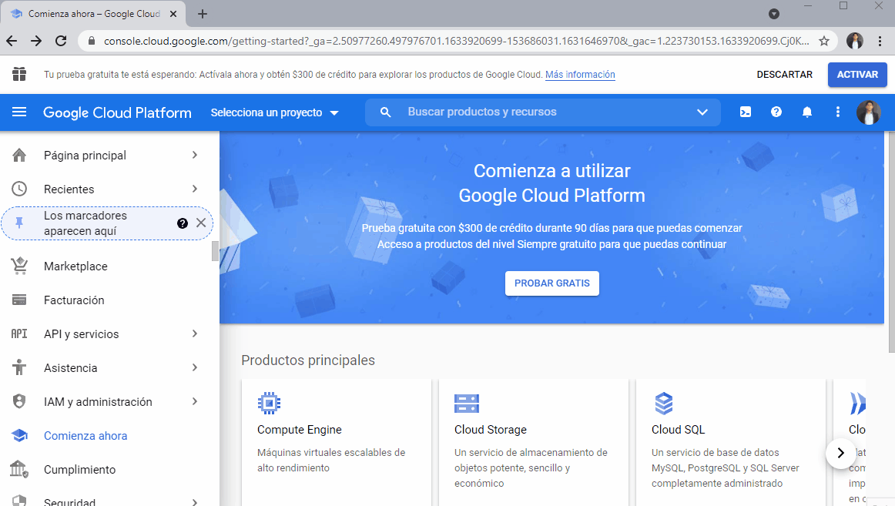
    </div>


    <!--
    <div style="text-align: center;">
    
    </div>
    -->


    En el siguiente link enseñan como crear un proyecto de una forma mas detallada: https://developers.google.com/workspace/guides/create-project


* **Paso 3:** Habilitar la API de Google Classroom y la API Google Drive

    <div align="center">
    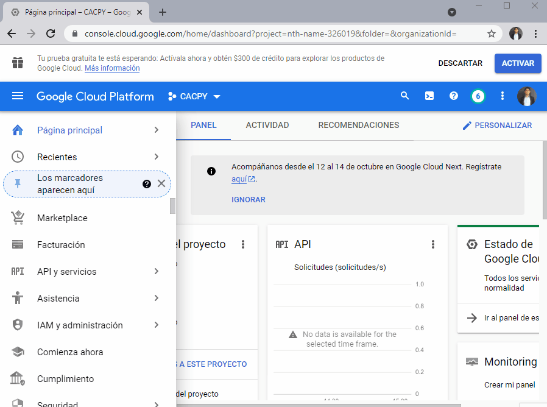
    </div>


    En el siguiente link enseñan como habilitar APIs de una forma mas detallada: https://developers.google.com/workspace/guides/create-project 

* **Paso 4:** Configurar y registrar el proyecto con un User Type igual a: **Externos**
    * Paso 1: Dar clic en el icono del Menu principal, el cual se encuentra en la esquina superior izquierda
    * Paso 2: Dar clic izquierdo sobre **APIs & Services > Pantalla de consentimiento de OAuth**
    * Paso 3: Elegir User Type igual a **Externos**
    * Paso 4: Escribir el nombre de la aplicación(puede ser cualquier nombre) para este ejemplo se pone
    el nombre de: **CACPY**
    * Paso 5: Solo se van a llenar los siguiente apartados:
        * En el apartado de correo electrónico de asistencia del usuario escribir su correo electronico
        * En direccion de contacto del desarrollador puedes escribir su correo electronico, para este 
        ejemplo escribi mi correo electronico: **roni.hernandez.1999@gmail.com**
    * Paso 6: Clic izquierdo sobre **Guardar y continuar**
    * Paso 7: Clic izquierdo sobre **Guardar y continuar**
    * Paso 8: Clic izquierdo sobre **volver al panel**

    <div align="center">
    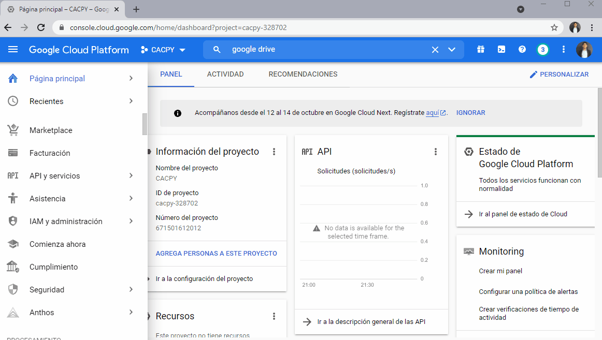
    </div>


* **Paso 5:** Agregar los correos electronicos que tendran acceso a la aplicación

    * Paso 1: Dar clic en el icono del Menu principal, el cual se encuentra en la esquina superior izquierda
    * Paso 2: Dar clic izquierdo sobre **APIs & Services > Pantalla de consentimiento de OAuth**
    * Paso 3: Dar clic izquierdo sobre **ADD USERS** 
    * Paso 4: Agregar los correos gmail que podran tener acceso al programa, para este ejemplo decidi agregar al correo:
        * roni.hernandez.1999@gmail.com
        
            Al agregar a este correo eso significa que el usuario que tenga dicho correo electronico como suyo, podra entrar al programa CACPY, los usuarios que quieran entrar al programa CACPY deberan registrar sus correos electronicos en este apartado o de lo contrario se les negara su acceso.

    * Paso 5: Dar clic sobre: **GUARDAR**

    <div align="center">
    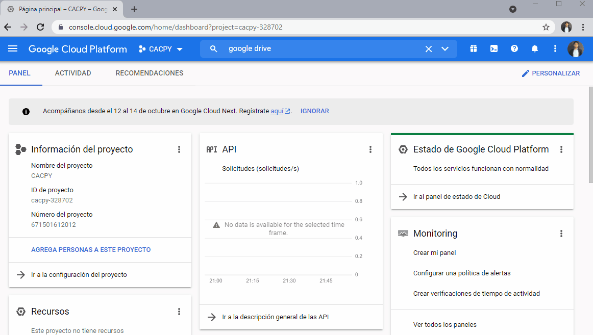
    </div>

* **Paso 6:** Finalmente descargar el archivo de credenciales

    * Paso 1: Dar clic en el icono del Menu principal, el cual se encuentra en la esquina superior izquierda
    * Paso 2: Dar clic izquierdo sobre: **APIs & Services > Credenciales**

    * Paso 3: Dar clic izquierdo sobre:
    **CREAR CREDENCIALES > ID de cliente OAuth**

    * Paso 4: Llenar los apartados siguientes:
        * En el apartado tipo de aplicacion poner: **App de escritorio** 
        * En el nombre de cliente colacar cualquier nombre, para este ejemplo se colocara el nombre default el cual es: **Cliente de escritorio 1**
    * Paso 5: Dar clic izquierdo sobre: **CREAR** 
    * Paso 6: Se desplegara un cuadro emergente con información de las credenciales creadas, unicamente se debe dar clic sobre el boton que dice: **ACEPTAR**

    * Paso 7: Finalmente hay que dirigirse a la tabla que dice **ID de clientes OAuth 2.0** y en la columna que dice: **Acciones** dar clic izquierdo sobre el simbolo de descargar


    <div align="center">
    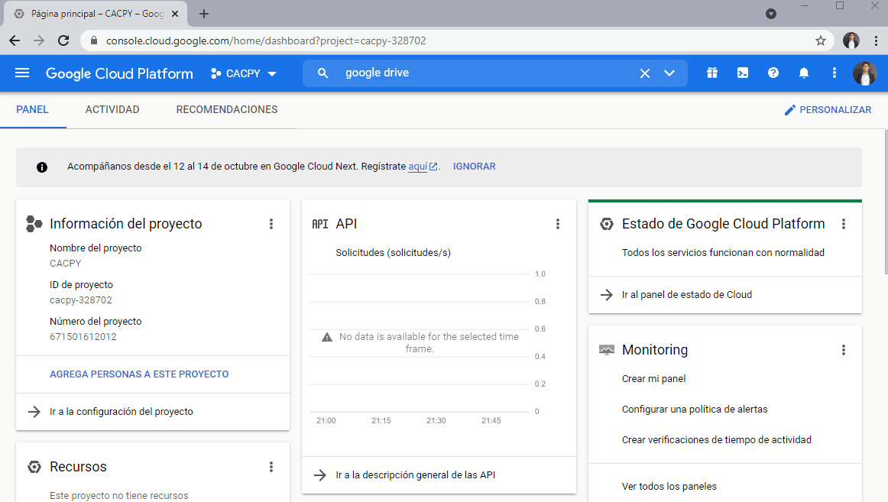
    </div>

    En el siguiente link enseñan comocrear las credenciales de una forma mas detallada: https://developers.google.com/workspace/guides/create-credentials


### **1.3) Sistemas operativos**
<div class="myWrapper" markdown="1" align="left">

[Regresar al menu principal](#menu)
</div>


El programa es multiplataforma por lo cual deberia minimo funcionar en: Windows,Linux y Mac.

El programa ha sido probado con exito en los siguientes sistemas operativos:

* MAC
* Windows 10 y Windows 11
* Linux Ubuntu 18.04

Sin embargo por cuestiones de disponibilidad de equipo no  ha podido ser probada en otras versiones de los sitemas operativos, sin embargo deberia funcionar en otros sistemas operativas y versiones de estos, debido a que la aplicación es multiplataforma.


<hr>

## **2) Como usar el programa**
<div class="myWrapper" markdown="1" align="center">

[Regresar al menu principal](#menu)
</div>

<hr>


### **2.1) La primera vez**
<div class="myWrapper" markdown="1" align="left">

[Regresar al menu principal](#menu)
</div>


Cuando es la primera vez que inicias el programa, deberas cargar el archivo de
credenciales(en el apartado anterior se menciona como obtenerlo), una vez cargado
dicho archivo deberas seleccionar la cuenta de Gmail con la que deseas trabajar y finalmente conceder todos los permisos requeridos, al realizar todo lo mencionado anteriormente se abrira el programa y estara listo para ser usado.A continuación se explica de una forma grafica de como hacer lo anterior mencionado.

<div align="center">

</div>


**Aclaración:** solo la primera vez que ejecutas el programa te pedira hacer todo lo anteriormente 
mencionado, sin embargo en las otras ocasiones cuando se inice sesión bastara con
solo ejecutar el programa.


### **2.2) Apartados del programa**
<div class="myWrapper" markdown="1" align="left">

[Regresar al menu principal](#menu)
</div>


El programa consta de 5 apartados:

* Informacion del programador
* Perfil
* Tareas
* Alumnos
* Configuraciones


### **2.2.1) Informacion del programador**
<div class="myWrapper" markdown="1" align="left">

[Regresar al menu principal](#menu)
</div>


En dicho apartado podras visualizar:

* El nombre del desarrollador de esta aplicacion de escritorio(mi nombre)
* El correo electronico del desarrollador(mi correo electronico)
* El likedin del desarrollador(mi likedin)
* El github del desarrollador(mi github)

<div align="center">
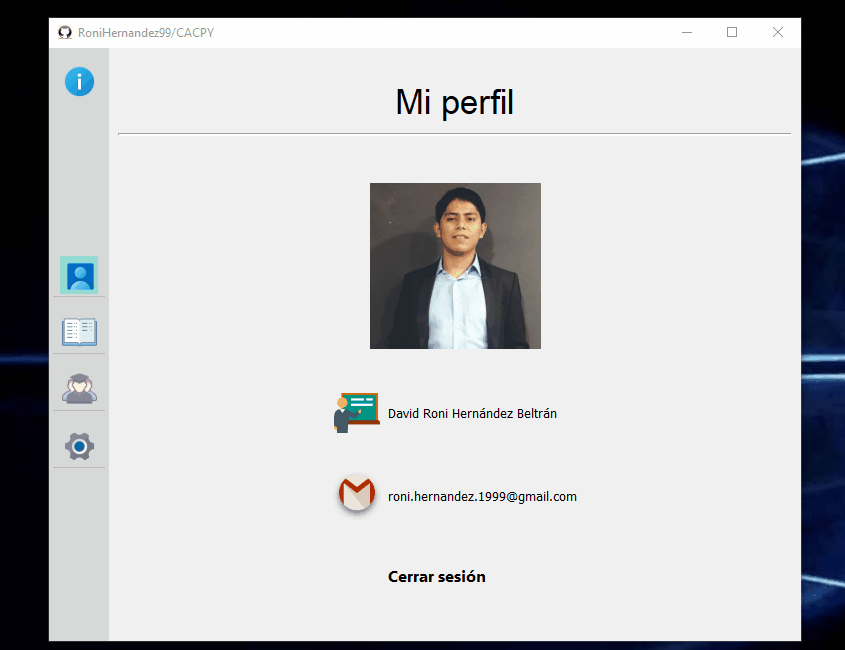
</div>


Es importante mencionar que:
 * Si deseas mandarme un correo electronico  bastara con
dar clic izquierdo sobre el nombre de mi electronico.

<div align="center">
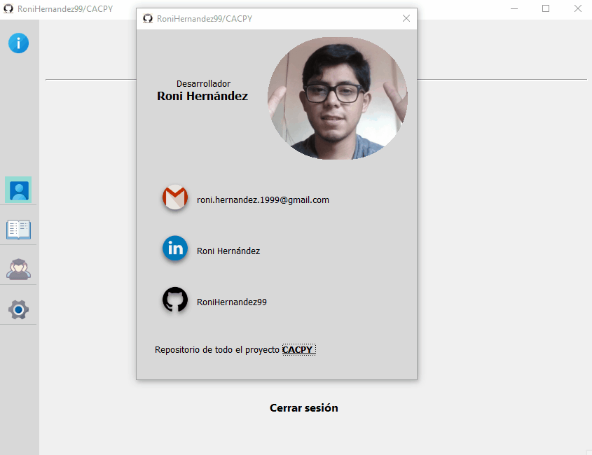
</div>


*  Si deseas ver mi likedin  bastara con
dar clic izquierdo sobre el nombre de mi likedin.

<div align="center">

</div>

*  Si deseas ver mi repositorio de github  bastara con
dar clic izquierdo sobre el nombre de mi repositorio

<div align="center">
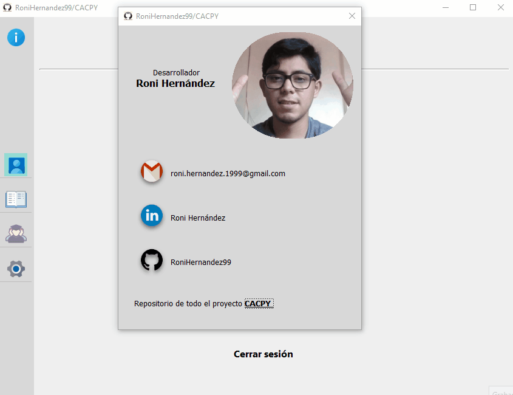
</div>


* Y finalmente si deseas ver todo el repositorio de este proyecto
bastara con dar clic izquierdo sobre el nombre del proyecto 

<div align="center">
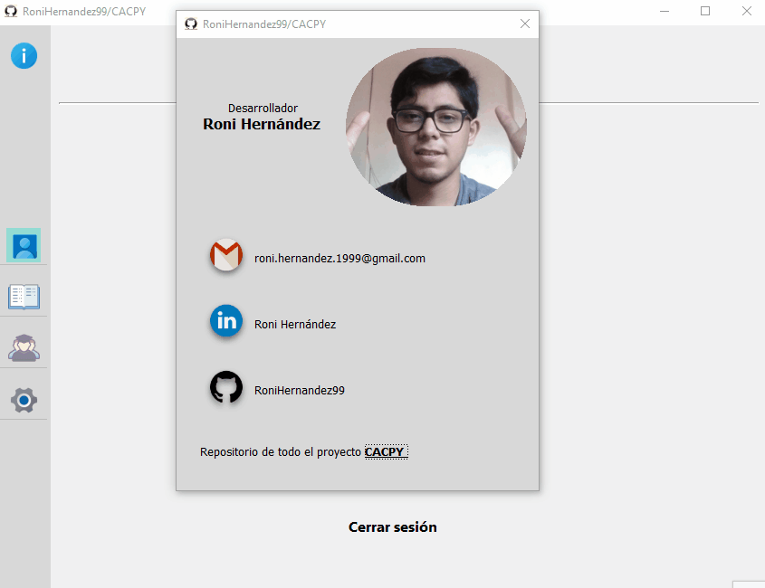
</div>


### **2.2.2) Mi Perfil**
<div class="myWrapper" markdown="1" align="left">

[Regresar al menu principal](#menu)
</div>

El apartado de **'Mi Perfil'** del programa muestra los datos del profesor que ha iniciado sesión
dentro de mi programa, es decir:

* Muestra la foto de perfil de la cuenta de Google con la que inicio sesión el profesor
* Muestra su correo de gmail con el que inicio sesión el profesor
* Muestra el nombre completo del profesor que inicio sesión

En el siguiente ejemplo se pueden apreciar los datos de la cuenta con la que inicie sesión:


<div align="center">
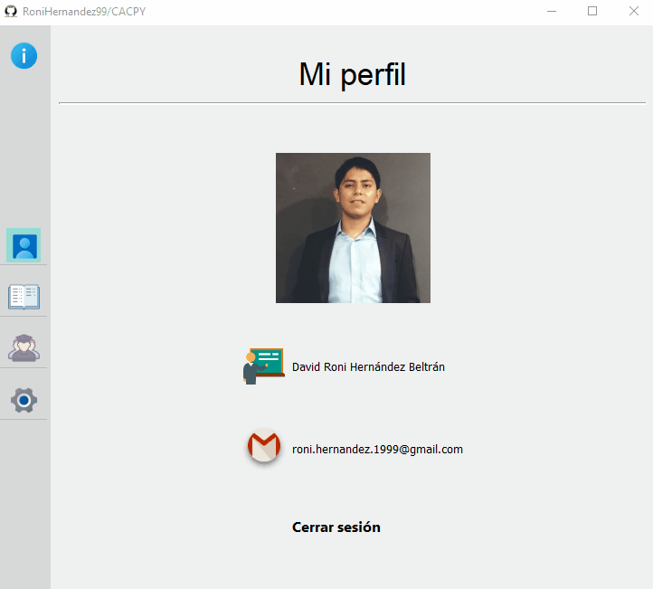
</div>


Para cerrar el programa hay dos maneras diferentes de hacerlo de hacerlo:

* Dando clic sobre el boton superior derecho con forma de tache
* Dando clic sobre el boton que se encuentra dentro del apartado **'Mi Perfil'**  con la leyenda: **Cerrar sesión**

Es importante mencionar que esas dos alternativas sirven para cerrar el programa, sin embargo lo hacen de una
forma distinta

* Si se cierra el programa dando clic sobre el boton superior derecho con forma de tache los datos del profesor
que inicio sesión en el programa, no se borraran, es decir los siguientes archivos no se borraran:
    * El token que se genero localmente para acceder a la API de Classroom y la API de Drive 
    * La base de datos local que se genero para respaldar datos del Classroom del profesor
    * Los ficheros locales que contienen el nombre y correo electronico del profesor
    * La foto de gmail del profesor

    Ventajas de cerrar el programa dando clic sobre el boton superior derecho con forma de tache:

    * Si se volviera a ejecutar el programa, esto se hara de una forma mas rapida.
    * Se guardaran las configuraciones que el profesor haya hecho la ultima vez que inicio sesión dentro del programa.
    * No se volveran a pedir los permisos para que se vuelva a generar el token.

<div align="center">
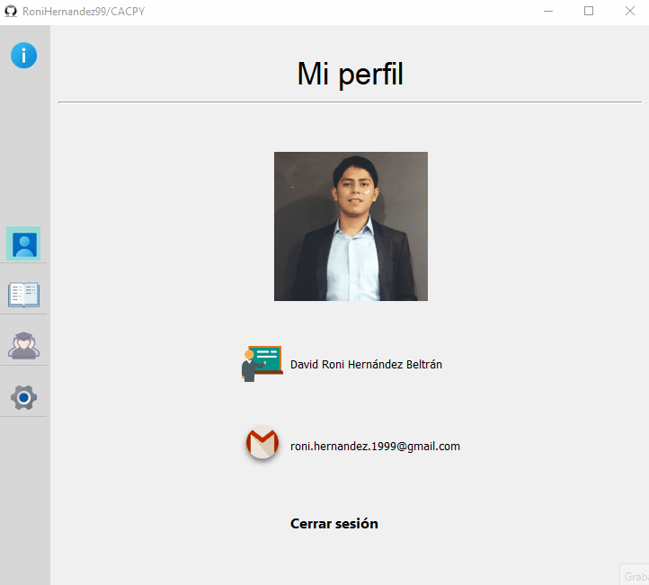
</div>


* Si se cierra el programa dando clic sobre el boton que se encuentra dentro del apartado **'Mi Perfil'**  con la leyenda: **Cerrar sesión** se borraran los siguientes archivos:
    * El token que se genero localmente para acceder a la API de Classroom y la API de Drive 
    * La base de datos local que se genero para respaldar datos del Classroom del profesor
    * Los ficheros locales que contienen el nombre y correo electronico del profesor
    * La foto de gmail del profesor

    Ventaja de cerrar el programa de esta manera:
    * El token que se genero para acceder a la API de Classroom y la API de Drive se elimina

    ¿Cuando puede resultar util? 
    * Si se desea iniciar sesión con otra cuenta de Gmail se debe cerra el programa de esta manera, ya
    que el programa solo permite ser accedido por una sesión a la vez.


<div align="center">

</div>


### **2.2.3) Mis configuraciones**
<div class="myWrapper" markdown="1" align="left">

[Regresar al menu principal](#menu)
</div>


En el apartado de configuraciones:
* Debera seleccionarse la clase de classroom  en la cual se encuentran las tareas que se desean calificar.
* Debera seleccionarse la clase de NbGrader en el cual se encuentran las tareas que se desean calificar.
* Debera seleccionarse la carpeta de Google Drive en donde se almacenaran todas las retroalimentaciones 
de las tareas de programación que se califiquen.
* Debera seleccionarse el topic en donde se encuentran las tareas de programación que se desean calificar.

**Observación:Si no se selecciona la clase de classroom,la clase de NbGrader,la carpeta de Google Drive y el topic,entonces no podra accederse al apartado de: 'Mis tareas'.Si no se selecciona por lo menos la clase de classroom y la carpeta de Google Drive, no podra accederse al apartado de: 'Mis alumnos'**


### **2.2.3.1) Seleccionando la clase de classroom**
<div class="myWrapper" markdown="1" align="left">

[Regresar al menu principal](#menu)
</div>


Para seleccionar una clase de classroom bastara con dar clic izquierdo sobre el boton con  imagen de lapiz que se encuentra al extremo derecho del apartado que dice **Clase**, una vez hecho lo anterior se desplegara un cuadro emergente que nos preguntara acerca de si estamos seguros de querer editar la clase de classroom, se le debe que dar clic en la opccioón: 'si', despues de hacer lo anterior se abrira una ventana en donde apareceran todas las clases de classroom de la cuenta de google con la que se entro, se debe seleccionar la clase de classroom en donde se encuentran las tareas de programación que se desean calificar.

La cuenta con la que se entro al programa para este ejemplo tiene 2 clases de classroom

<div align="center">

</div>

Para este ejemplo se seleccionara la clase: **Python para principiantes** desde el programa:

<div align="center">
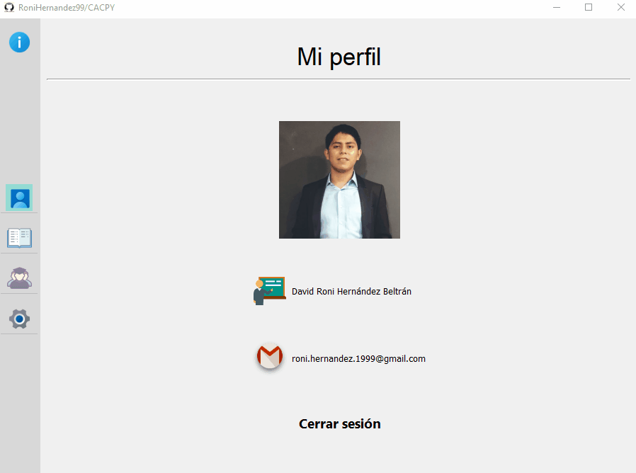
</div>

### **2.2.3.1.1] Que hacer si no aparece la clase de classroom que quiero seleccionar**
<div class="myWrapper" markdown="1" align="center">

[Regresar al menu principal](#menu)
</div>


Si a la hora de querer seleccionar una clase de classroom no se encuentra entre las opcciones la clase de classroom  que deseas seleccionar, se debera dar clic izquierdo sobre el boton 'refrescar', posteriormente se abrira un cuadro emergente de dialogo, debera darse clic sobre la opccion 'si', en la siguiente gif se ilustra lo anteriormente mencionado:

<div align="center">
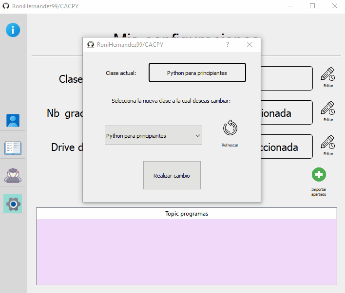
</div>


### **2.2.3.2) Seleccionando la clase de NbGrader**
<div class="myWrapper" markdown="1" align="left">

[Regresar al menu principal](#menu)
</div>


Para seleccionar una clase de nbgrader bastara con dar clic izquierdo sobre el boton con  imagen de lapiz que se encuentra al extremo derecho del apartado que dice **Nb_grader**, una vez hecho lo anterior se desplegara un cuadro emergente que nos preguntara acerca de si estamos seguros de querer editar la clase de NbGrader, se le debe que dar clic sobre la opccion 'si', despues de hacer lo anterior se abrira una ventana en donde apareceran todas las clases de 'NbGrader' que se pueden elegir, para seleccionar una bastara con dar clic izquierdo sobre ella y posteriormente dar clic sobre el boton: 'Realizar cambio'


Ejemplo:

En el siguiente ejemplo se elegira la clase de NbGrader cuyo nombre es: **'curso_pythonBasico'**

<div align="center">
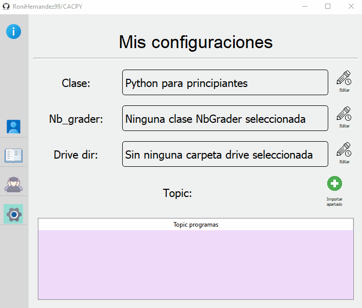
</div>


### **2.2.3.2.1) Que hacer si no aparece la clase de NbGrader que quiero seleccionar**
<div class="myWrapper" markdown="1" align="center">

[Regresar al menu principal](#menu)
</div>


Si a la hora de querer seleccionar una clase de NbGrader no se encuentra entre las opcciones la clase de NbGrader  que deseas seleccionar, unicamente debera dar clic izquierdo sobre el boton 'refrescar',en la siguiente gif se ilustra lo anteriormente mencionado:

<div align="center">
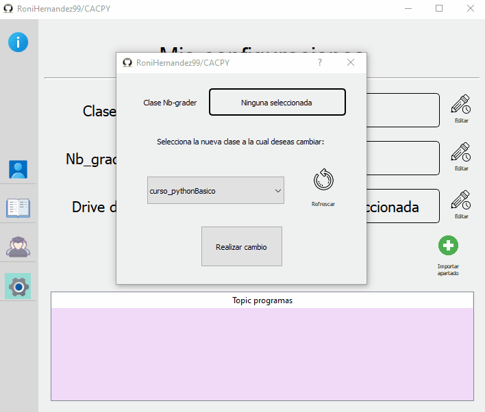
</div>


### **2.2.3.2.2) Donde se encuentran las clases de NbGrader que puedo seleccionar en el programa**
<div class="myWrapper" markdown="1" align="center">

[Regresar al menu principal](#menu)
</div>


Las clases NbGrader que el programa le permitira elegir son las que se encuentren en la misma ruta en donde se encuentra almacenado el codigo fuente del programa en la dirección especifica:  **'/RECURSOS/NB_GRADER/'**.

Ejemplo:

Imaginemos que  se descarga por primera vez el codigo fuente del programa. Al abrir la  carpeta que contiene el codigo fuente se observara lo siguiente:

<div align="center">
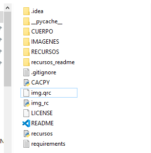
</div>

Las clases de NbGrader que se podran seleccionar en el programa se encuentran la ruta: **'/RECURSOS/NB_GRADER/'**, por tal motivo cuando se desea crear una clase de NbGrader, debera crearse  en dicha ruta.

Para este ejemplo si nos dirigimos a dicha ruta se podra observar que hay 2 clases con los nombres de:

* curso_pythonBasico
* python_bien

<div align="center">
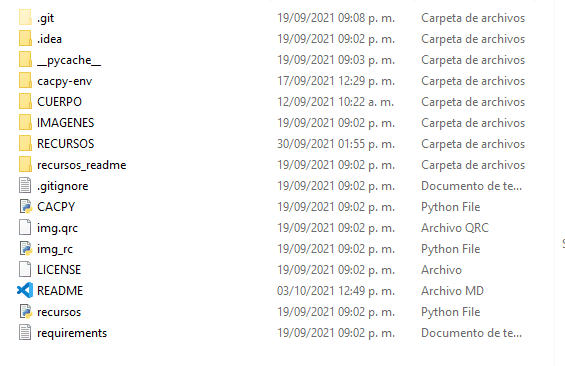
</div>


Por tal motivo cuando se abre el programa y se desea editar la clase seleccionada de NbGrader, el programa nos mostrara como posibles opcciones a seleccionar las clases NbGrader:

* curso_pythonBasico
* python_bien


<div align="center">
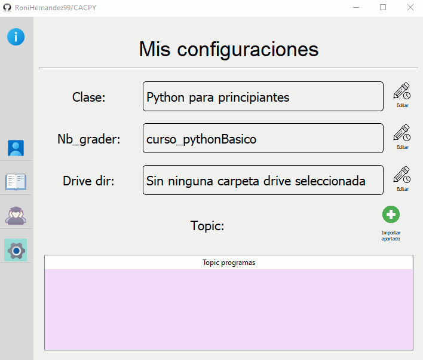
</div>


### **2.2.3.2.3) Como crear clases NbGrader**
<div class="myWrapper" markdown="1" align="left">

[Regresar al menu principal](#menu)
</div>


Si se desea crear una clase de NbGrader, con el objetivo de usarla en el programa CACPY, deberas crear la clase NbGrader en la ruta respectiva explicada en el punto: **2.2.3.2.2**.

En el siguiente video de youtube explican como hacer clases de NbGrader asi como tareas:

[](https://www.youtube.com/watch?v=5WUm0QuJdFw) 

Tambien puedes consultar información en los siguientes links:

* https://noteable.edina.ac.uk/nbguide/#show_gs_c

* https://nbgrader.readthedocs.io/en/stable/user_guide/creating_and_grading_assignments.html#developing-assignments-with-the-assignment-toolbar


### **2.2.3.3) Seleccionando la carpeta de google drive de retroalimentaciones**
<div class="myWrapper" markdown="1" align="center">

[Regresar al menu principal](#menu)
</div>


Para seleccionar la carpeta de google drive en donde se almacenaran todas las retroalimentaciones 
que se realicen de los alumnos, se debera dar clic sobre  el boton con  imagen de lapiz que se encuentra al extremo derecho del apartado que dice **Drive dir**, una vez hecho lo anterior se desplegara un cuadro emergente, se le debera que dar clic sobre la opccion 'si', despues de hacer lo anterior se abrira una ventana en donde se  pedira que se ingrese el **'id'** de la carpeta de google drive en donde se desea que se almacenen todas las retroalimentaciones de los alumnos


<div align="center">
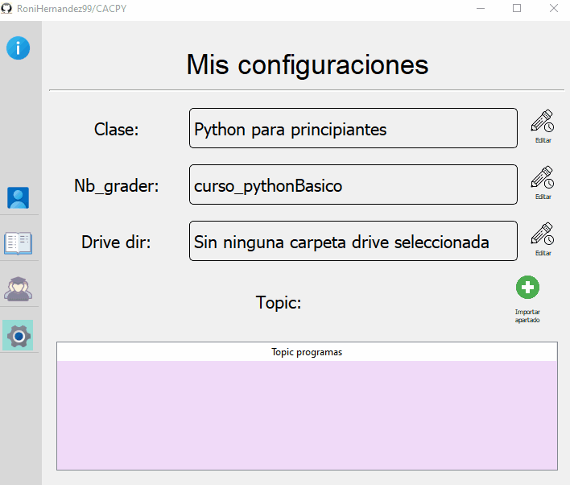
</div>

Para este ejemplo se creara una carpeta en google drive con el nombre de: **'CACPY_retroalimentaciones'**
posteriormente se adjuntara el id de dicha carpeta en el apartado que nos  piden el **id**

<div align="center">
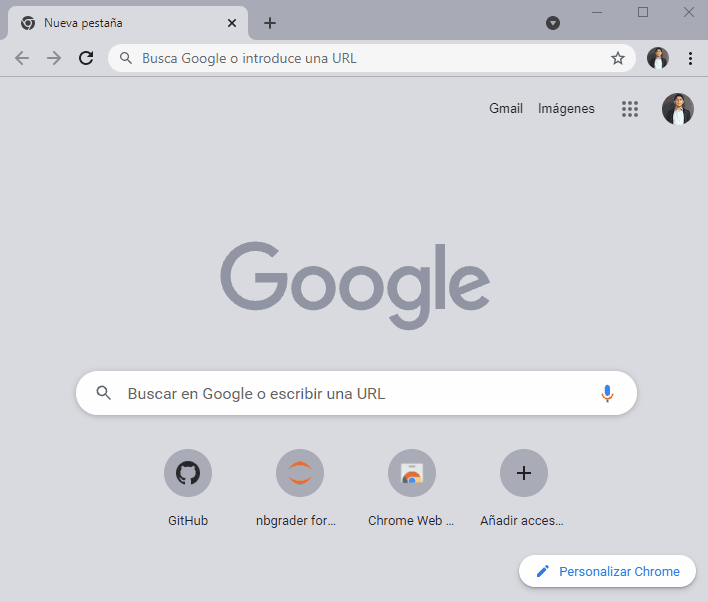
</div>


Una vez adjuntado el id, se debera dar clic izquierdo sobre el boton: **'Realizar cambio'**, despues de hacer lo anterior se desplegara una ventana que  mostrara el nombre y el link de acceso  de la carpeta del **id** que se ingreso, todo esto con el fin de que se pueda corraborar de si efectivamente el **id** de la carpeta que se ingreso es el de la carpeta que en realidad se desea.

<div align="center">
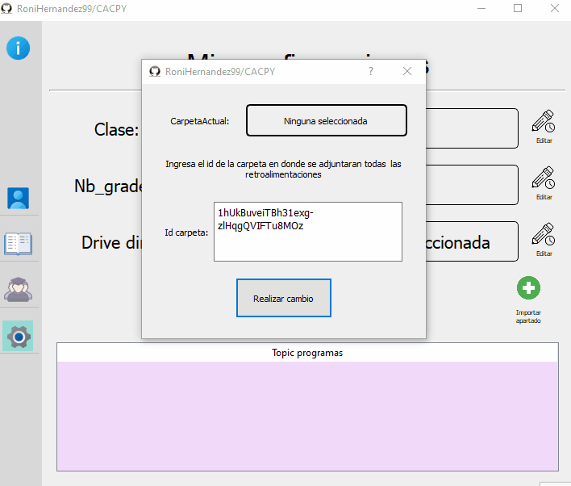
</div>

Si se desea acceder a la carpeta del **id** que se ingreso,para poder comprobar que si es la carpeta que se desea, bastara con dar clic izquierdo sobre el nombre de la carpeta que se encuentra en letras negras y subrayado con una linea de color negro.

<div align="center">
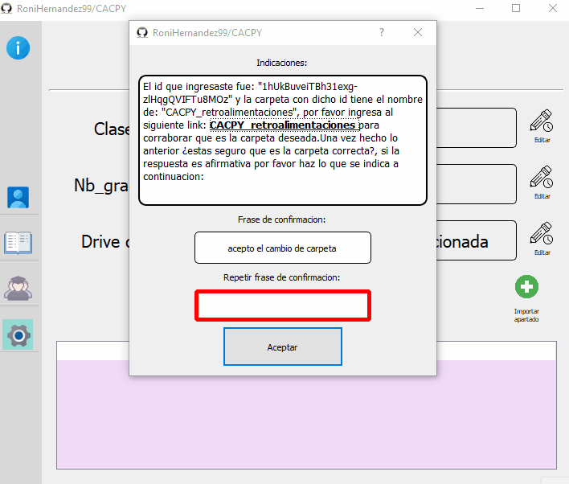
</div>

Una vez que se haya comprobado de que el **id** que se ingreso  si es el de la carpeta que se desea, se debera repetir la frase que se pide en la ventana, para darle a entender al programa de que si es la carpeta correcta, una vez repetida la frase debera darse clic sobre el boton **'Aceptar'**, posteriormente se abrira un cuadro de dialogo, debera darse clic izquierdo sobre la opcción **'Si'**, al hacer lo mencionado anteriormente quedara guardada la carpeta que se eligio y ya podran cerrarse las ventanas que aun sigan abiertas.

<div align="center">

</div>


### **2.2.3.3.1) Como se guardan las retroalimentaciones en la carpeta de drive seleccionada**
<div class="myWrapper" markdown="1" align="center">

[Regresar al menu principal](#menu)
</div>


En la carpeta de drive que se eliga se almacenaran todas las retroalimentaciones en la ruta que les correspondan, dicha ruta estara dada por la siguiente formula:
**'nombreClaseClassroom/idDelAlumno/nombreTarea/'**

```
├── nombreClaseClassroom
│   ├── idDelAlumno
│   │   ├── nombreTarea
│           ├── nombreTarea_intento_1.ipynb
│           ├── nombreTarea_intento_2.ipynb
│           ├── nombreTarea_intento_3.ipynb
│           └──            .
│           └──            .
│           └──            .
```

Supongamos que hay un alumno cuyo id es: **'114283316418743255552'**,dicho alumno se encuentra inscrito  en la clase de classroom: **'Python para principiantes'** y dicho alumno realizo la entrega de una tarea de programación con el nombre de: **'tarea_1'**, posteriormente su maestro le califica automaticamente su tarea con ayuda del sofware: CACPY ¿donde y como se guardara la retroalimentación del alumno de dicha tarea?

```
├── Python para principiantes
│   ├── 114283316418743255552
│   │   ├── tarea_1
│           └── tarea_1_intento_1.ipynb
```


**Python para principiantes/id del alumno/tarea_1/**

### **2.2.3.2) Seleccionando el topic de google classroom**
<div class="myWrapper" markdown="1" align="left">

[Regresar al menu principal](#menu)
</div>


Los topcis de classroom que se pueden seleccionar son los que aparecen en la **'tabla de topics seleccionables'**, sin embargo es importante mencionar si no hay ninguno en la tabla  significa que no se a importado ninguno, en la siguiente imagen se podrar apreciar claramente cual es la **'tabla de topics seleccionables'** y como se ve cuando se encuentra vacia.

<div align="center">
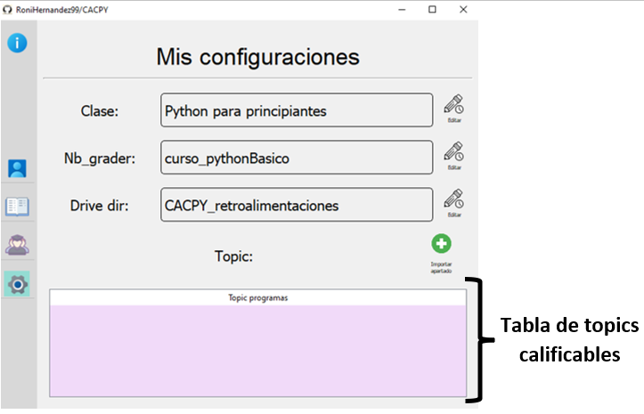
</div>

Para importar topics a la **'tabla de topics seleccionables'**  se debera dar clic sobre el boton: **'Importar apartado'** al hacer lo anterior se abrira una ventana que mostrara todos los topics que no se encuentran en  la **'tabla de topics seleccionables'** y que pertencen a la clase de classroom seleccionada, sin embargo es importante recalcar de que si al abrir la ventana no se encuentra  el topic que se desea agregar a la  **'tabla de topics seleccionables'**, entonces deberar darse clic sobre el botón **'refrescar'**  y despues clic sobre la opcción '**Si**' todo ello con la finalidad de que  el sofware revise si le falta algun topic por mostrar.

En la siguiente gif que se mostrara a continuación se podra apreciar claramente que al dar dar clic sobre el boton: **'Importar apartado'** en la ventana que se abre no aparece ningun topic, a pesar de que se sabe que en la clase de classroom que tiene seleccionada la cual es: **'python para principiantes'** si tiene topics, y son los siguientes:

* Apuntes
* Tarea de clase

<div align="center">
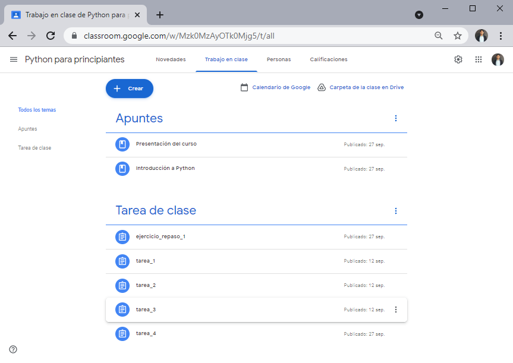
</div>

Por tal motivo en la  gif que se mostrara a continuación se procedio a dar clic sobre el boton **'refrescar'**, despues de hacer eso ve claramente como aparecen los topics de la clase de classroom seleccionada

<div align="center">
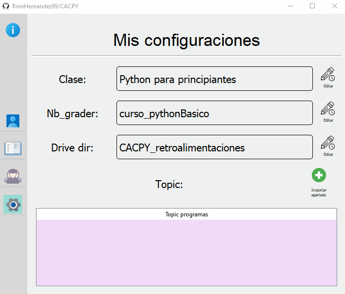
</div>

Para importar un topic a la **'tabla de topics seleccionables'** se debera dar clic sobre el topic, y posteriormente clic sobre el boton **'Agregar'**

Para el siguiente ejemplo se importara el topic cuyo nombre es: '**Tarea de clase**'  

<div align="center">
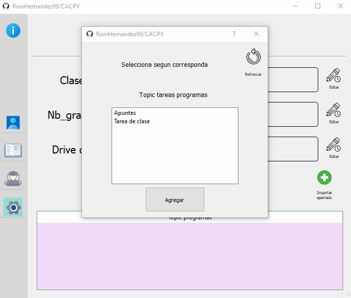
</div>

Si se desea importar otro topic se debera repetir el mismo procedimiento mencionado previamente

Para el siguiente ejemplo se importara ahora el topic cuyo  nombre es: '**Apuntes**'  

<div align="center">

</div>

Si se desea eliminar un topic de la **'tabla de topics seleccionables'** se debera dar clic derecho sobre el nombre del topic eliminado, posteriormente clic izquierdo sobre. **'eliminar'** y despues clic izquierdo sobre la opcción **'Si'**

En el siguiente ejemplo se eliminara el topic: **Apuntes**

<div align="center">
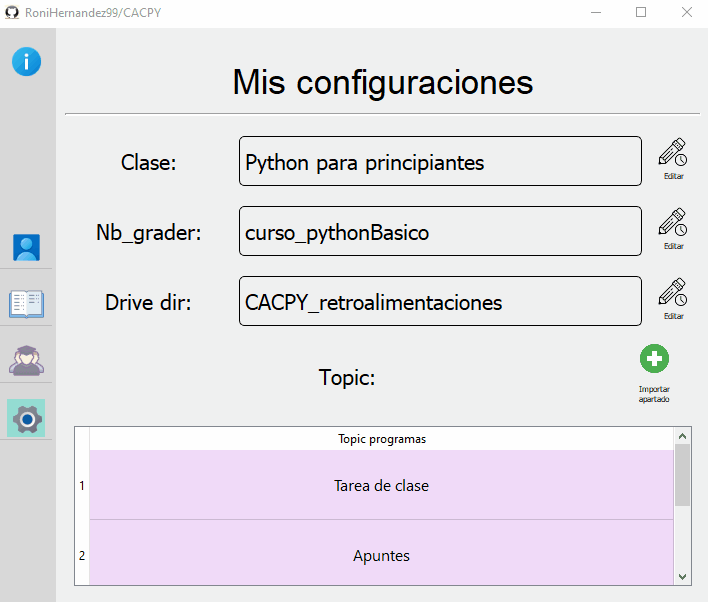
</div>


Finalmente para poder seleccionar un topic se debera dar doble clic izquierdo sobre el nombre del topic que se desea seleccionar y que se encuentra en la **'tabla de topics seleccionables'**

En el siguiente ejemplo se seleccionara el topic: **Tarea de clase**

<div align="center">
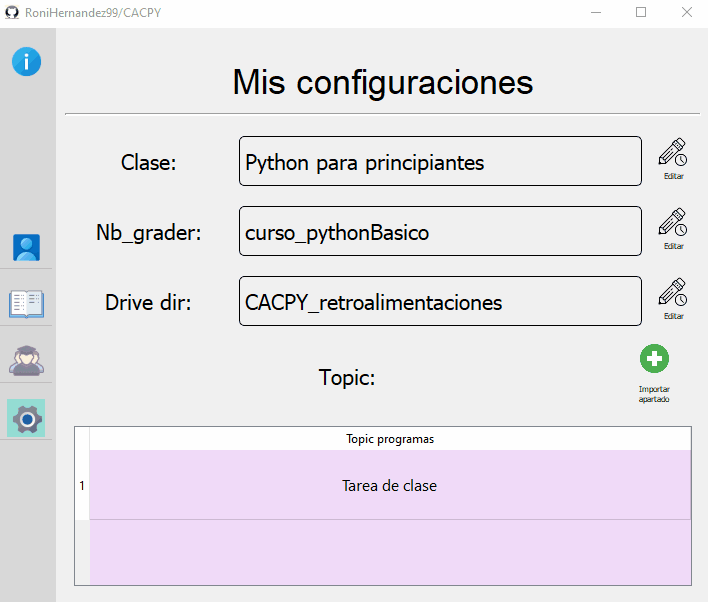
</div>


### **2.2.4) Mis tareas**
<div class="myWrapper" markdown="1" align="left">

[Regresar al menu principal](#menu)
</div>

El programa  unicamente  permitira el acceso a este apartado hasta que se haya seleccionado en el apartado de configuraciones:

* La clase de classroom en donde se encuentran la o las tareas que se desean calificar
* El topic de classroom en donde se encuentra la o las tareas que se desean calificar
* La clase de NbGrader en donde se encuentran las tareas que se dejaron a los alumnos y que se desean calificar
* La carpeta de drive en donde se almacenaran todas las retroalimentaciones.

### **2.2.4.1) Para que sirve el apartado de: 'Mis tareas'**
<div class="myWrapper" markdown="1" align="left">

[Regresar al menu principal](#menu)
</div>


El apartado de: **Mis tareas** a grosso modo sirve para dos cosas especificamente:

* Asignar tareas de programación en google classroom
* Calificar las tareas de programación


### **2.2.4.2) Como importar una tarea a la tabla de tareas calificables**
<div class="myWrapper" markdown="1" align="center">

[Regresar al menu principal](#menu)
</div>

Cuando se abre por primera vez el apartado mis tareas se podran observar  basicamente 4 cosas:

* El nombre de la  clase de de google classroom y el topic google classroom seleccionados previamente en el apartado de: **'Mis configuraciones'**.

* La **'tabla de tareas calificables'**

* El boton para importar tareas a la **'tabla de tareas calificables'**

* El boton para poder asignar tareas de programación en google classroom


<div align="center">
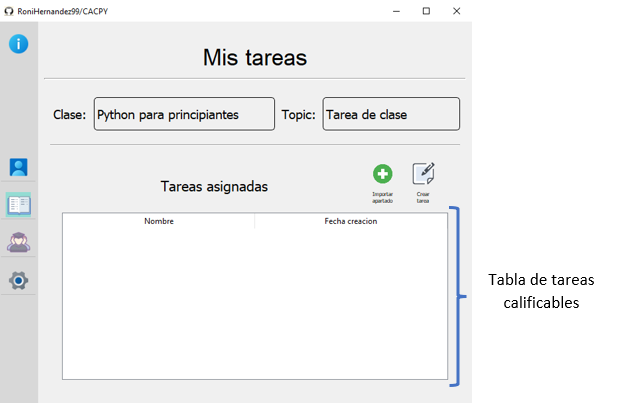
</div>

La **'tabla de tareas calificables'** contendra las tareas que se pueden calificar, si la tabla no  tiene la tarea que se desea calificar, entonces se debera importar dicha tarea a la **'tabla de tareas calificables'**, para hacer eso se debera dar clic sobre el boton: **'Importar apartado'**, al hacer lo anterior se abrira una ventana que mostrara todas las tareas que se han asignado en la clase y topic de google classrom previamente seleccionados en el apartado de: **'Mis configuraciones'**

En el siguiente gif se podra apreciar que la **'tabla de tareas calificables'** se encuentra vacia, por tal motivo se procede a dar clic sobre  el boton: **'Importar apartado'** con el objetivo de agregar una tarea a la **'tabla de tareas calificables'**

<div align="center">
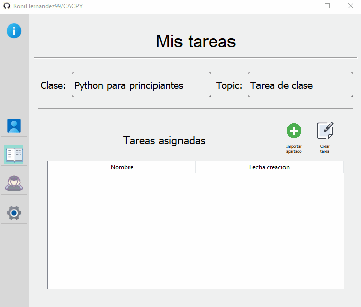
</div>

Sin embargo es importante recalcar de que si en la ventana que se abrio al dar clic sobre el boton: **'Importar apartado'**, se encuentra vacia o no contiene la tarea que se desea agregar a la: **'tabla de tareas calificables'**, entonces se debera clic sobre el botón **'refrescar'**, posteriormente se abrira una ventana en la cual se debera dar  clic sobre la opcción '**Si**' todo ello con la finalidad de hacer que el sofware revise si le falta alguna tarea que mostrar y que pueda ser agregada a la **'tabla de tareas calificables'** 

En la siguiente gif que se mostrara a continuación se podra apreciar claramente que al dar dar clic sobre el boton: **'Importar apartado'** en la ventana que se abre no aparece ninguna tarea, a pesar de que se sabe que en la clase y topic de classroom que se seleccionaron en el aparto de: **'Mis configuraciones'** si contienen tareas adjuntas, es decir en la clase de classroom: **'Python para principiantes'** en el topic: **'Tarea de clase'** hay tareas adjuntas las cuales son:

* ejercicio_repaso_1
* tarea_1
* tarea_2
* tarea_3
* tarea_4

<div align="center">
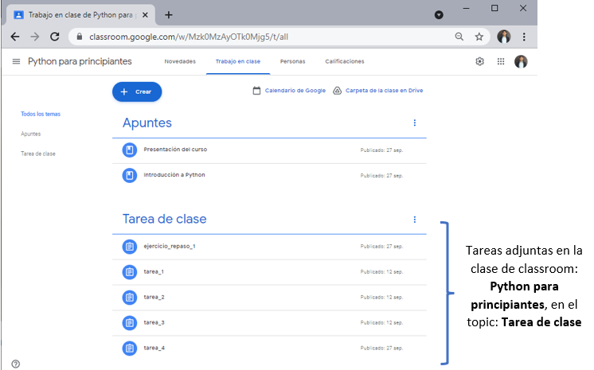
</div>


Por tal motivo al dar dar clic sobre el boton: **'Importar apartado'** en la ventana que se abre debieron aparecer dichas tareas, pero como no aparecieron se procedio a dar clic sobre el boton **'refrescar'**, despues de hacer eso  se ve claramente como aparecen las tareas.

<div align="center">
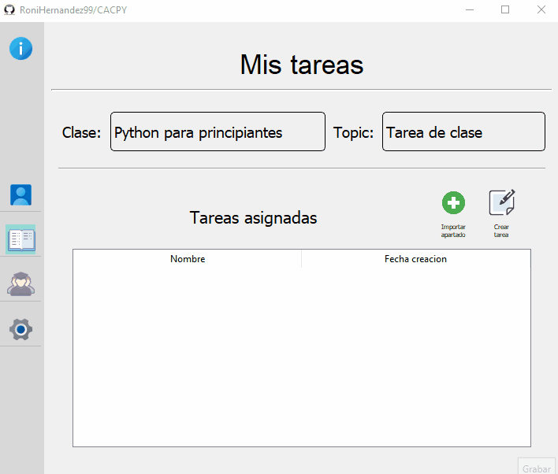
</div>


Para importar un topic a la **'tabla de tareas calificables'**  se debera dar doble clic izquierdo sobre el nombre de la tarea que se desea importar 


Para el siguiente ejemplo se importara la tarea  cuyo nombre es: '**tarea_1**'  


<div align="center">
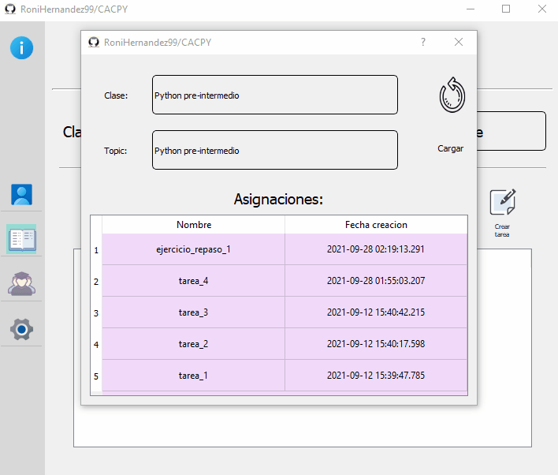
</div>

Si se desea importar otro topic se debera repetir el mismo procedimiento mencionado previamente

Para el siguiente ejemplo se importara ahora la tarea cuyo nombre es: '**tarea_2**', despues 
la tarea cuyo nombre es:'**tarea_3**' y por ultimo se importara la tarea cuyo nombre es '**ejercicio_repaso_1**'  

<div align="center">
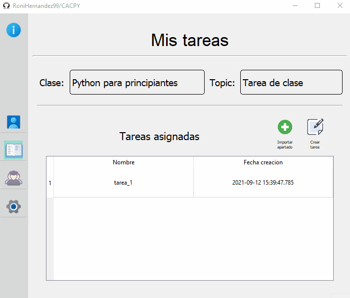
</div>

El objetivo de que se importen la tareas a la **'tabla de tareas calificables'**  para que estas puedan ser calificadas es por que en una clase de classroom en un topic en particular no solo contendran tareas de programación, es decir no todas las tareas que contenga el topic seran de programación asi que no todas esas tareas desearan ser calificadas por CACPY, por eso se hace que se importen las tareas que si son de programación y desean ser calificadas con CACPY.

### **2.2.4.3) Como eliminar una tarea a la tabla de tareas calificables**
<div class="myWrapper" markdown="1" align="center">

[Regresar al menu principal](#menu)
</div>

Supongamos que ya no se desea  calificar una tarea por que todos los alumnos ya la entregaron o por que  ya paso la fecha de entrega de dicha tarea, por tal motivo ya no es necesario que dicha tarea siga apareciendo en la tabla de tareas calificables, asi que para mantener el orden se desea eliminar dicha tarea de la tabla de tareas calificables, ¿como se podra eliminar? R= si se desea eliminar una tarea  de la **'tabla de tareas calificables'** se debera dar clic derecho sobre el nombre de la tarea que se quiere eliminar, posteriormente clic izquierdo sobre: **'eliminar'** y despues clic izquierdo sobre la opcción **'Si'**

En el siguiente ejemplo se eliminara la tarea con el nombre de: **Tarea_3** y despues se eliminara la tarea con el nombre de: **Tarea_2**

<div align="center">
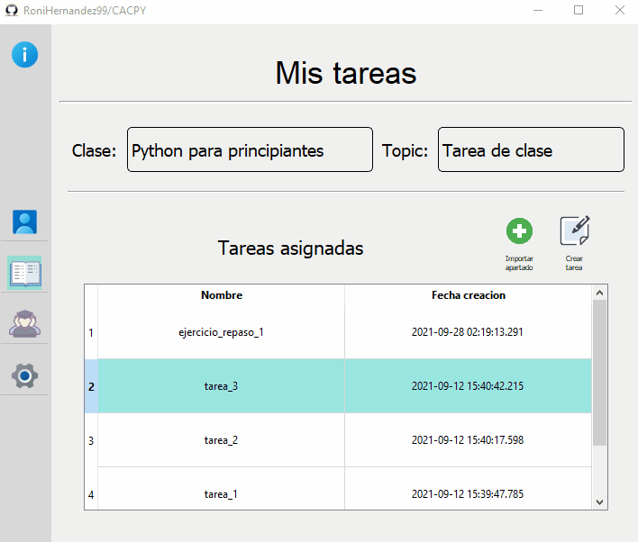
</div>


### **2.2.4.4) Como calificar una tarea**
<div class="myWrapper" markdown="1" align="left">

[Regresar al menu principal](#menu)
</div>

Para calificar las tareas entregadas se debera dar clic izquierdo sobre el nombre de la tarea que se desea calificar, posteriormente el programa mostrara  un apartado en el cual se podran ver los datos de la tarea que se desea calificar, los cuales seran: 
* El nombre de la tarea que se desea calificar 
* La fecha en la cual fue creada dicha tarea
* Cuantas entregas de dicha tarea ya han sido calificadas
* Cuantas entregas de dicha tarea han sido entregadas pero NO calificadas
* Cuantas entregas de dicha tarea faltan por entregar

En dicho apartado tambien vendra un boton con imagen de un icono de notas  el cual debera se presionado cuando se deseen calificar las entregas de la tarea que se desea calificar.

Ejemplo:

* Se desea calificar las entregas realizadas en la tarea cuyo nombre es: **ejercicio_repaso_1** por tal motivo se da clic sobre el nombre de la tarea, al hacer lo anterior se podra apreciar claramente que:

* Fue creada el 28 de septiembre del 2021.
* No se ha calificado ninguna entrega de dicha tarea.
* Ya han realizado su entrega de dicha tarea 2 alumnos.
* Ya no falta ningun alumno por entregar dicha tarea.


<div align="center">
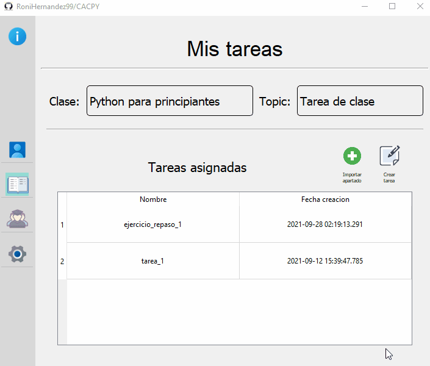
</div>


Como se menciono anteriormente  el apartado que se abrio contiene un boton con imagen de un icono de notas, el cual debera se presionado cuando se deseen calificar las entregas de la tarea, al dar clic sobre dicho boton se desplegara una ventana nueva que mostrara los mismo datos ya mostrados de la tarea que se desea calificar y aparte mostrara mas cosas

<div align="center">
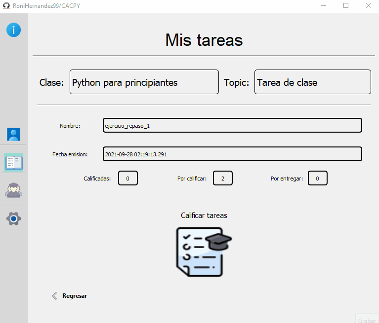
</div>

La ventana que se abrio al dar clic sobre el  boton con imagen de un icono de notas sirve para calificar las entregas de los estudiantes de la tarea que se desea calificar, para calificar las entregas bastara con especificarle al programa el numero de entregas que se desean calificar y posterior a ello dar clic izquierdo sobre el boton: **'Calificar'**, una vez hecho lo anterior los nombres de los alumnos junto con su calificación obtenida estaran apareciendo en la tabla de color rosa:

<div align="center">
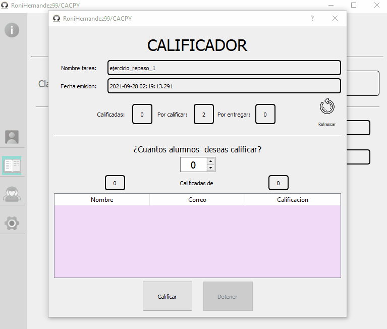
</div>

Observacion: Por cada alumno que entrego la tarea y que fue califcado el programa le compartira la retroalimentación de su tarea y la calificación respectiva, todo esto  a través de Google classroom, por ende le llegaran las respectivas noficaciones a su correo cuando esto suceda.
Cuando un alumno que fue calificado  abra su google classroom en la tarea que fue calificada vera:

* Su calificación respectiva.
* Un link adjunto que lo dirigira a una carpeta de google drive:
    * Dicha carpeta de google drive unicamente almacenara las retroalimentaciones de ese alumno y esa tarea en particular(las retroalimentaciones son archivos html), sin embargo  esta carpeta podra contener mas de una retroalimentacion, ya que el alumno puede entregar la tarea mas de una vez.
    * Dicha carpeta de google drive se encuentra almacenada en la carpeta de google drive que el maestro eligio en el apartado de: **'Mis configuraciones'** y se encuentra almacenada en la ruta: 
    **'nombreClaseClassroom/idDelAlumno/nombreTarea/'**
    * Dicha carpeta de google drive unicamente se comparte en modo de vista con el alumno que realizo la entrega de la tarea, es decir unicamente podra acceder a ella en modo de vista el alumno que realizo la entrega de la tarea.


<div align="center">
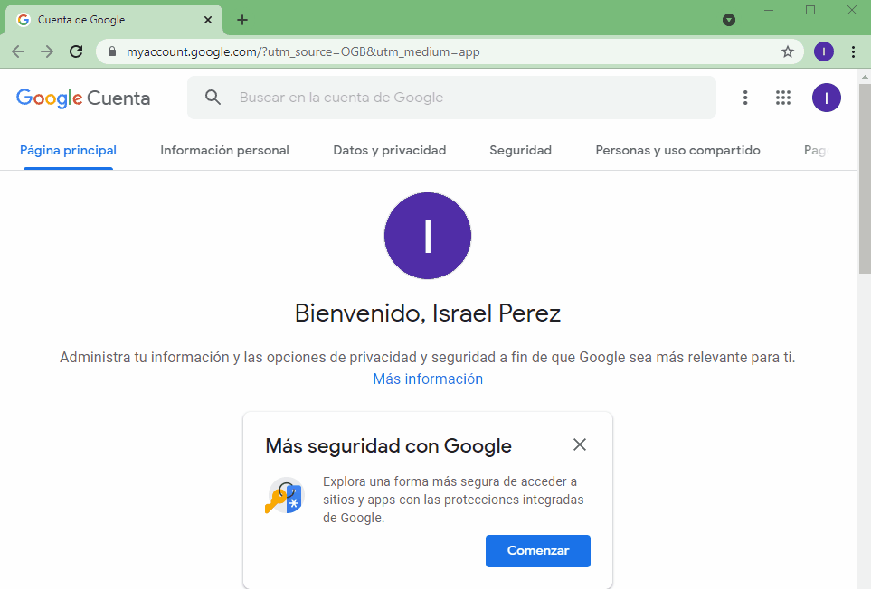
</div>

Para que el alumno pueda ver la retroalimentación, el alumno debera descargarla y abrirla con su navegador favorito:

<div align="center">

</div>


Si el alumno deseara volver a entregar una tarea por que saco una mala calificación y desea mejorar, o por que se dio cuenta que cometio algun error, o por cualquier otra circunstancia, lo que debera hacer el alumno es lo siguiente:
* **Paso 1:** Dar clic sobre: **'Anular la entrega'**
* **Paso 2:** Si la tarea ya fue calificada debera cerrar el link que se le adjunto para acceder a sus retroalimentaciones.
* **Paso 3:** Corregir la tarea, y posteriormente volverla entregar.

<div align="center">
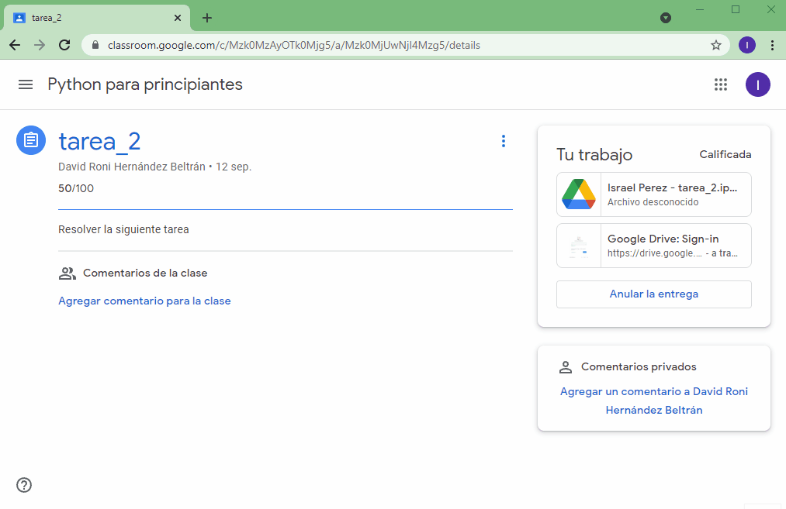
</div>


Si el alumno al estar resolviendo la tarea elimino por accidente algun codigo de la tarea y ya no puede restablecerlo a como era antes, para recuperar la tarea al estado original en el que la dejo el maestro el alumno debera hacer lo siguiente:

* **Paso 1:** Cerrar el colab en donde estaba resolviendo la tarea
* **Paso 2:** Dirigirse a la publicacion de la tarea y cerrar el archivo adjunto de la tarea para que se elimine
* **Paso 3:** Dar clic izquierdo sobre **'Crear un copia'**

<div align="center">
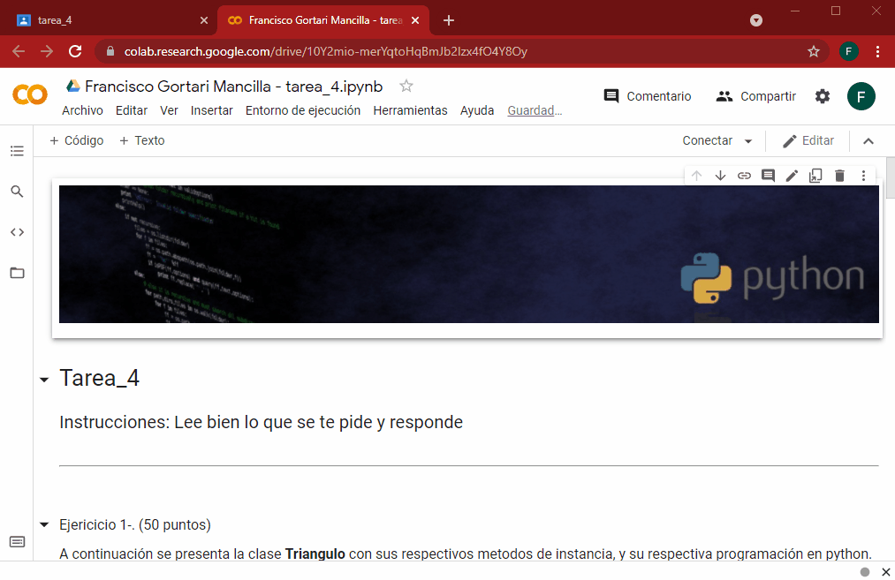
</div>


Es importante mencionar lo siguiente:

* Si se desean calificar mas tareas despues de que el programa haya terminado de calificar las tareas
se debera dar clic izquierdo sobre el boton: **'Calificar mas tareas'**


<div align="center">
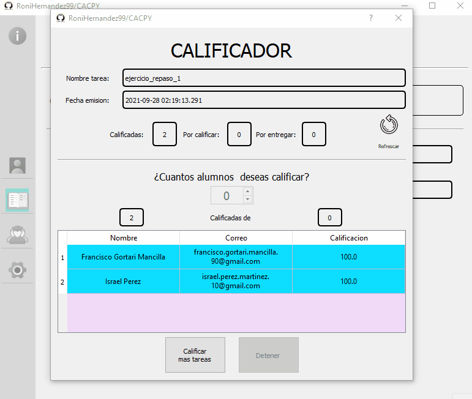
</div>


* Es probable que mientras se encontraba calificando, algunos de sus  estudiantes que no habian realizado la entrega de su tarea apenas la  hayan realizado, por tal razon existe el boton: **'refrescar'** pues al dar clic izquierdo sobre el: hara que el programa revise si hay alguna nueva  entrega de esta tarea que pueda ser calificada.


<div align="center">
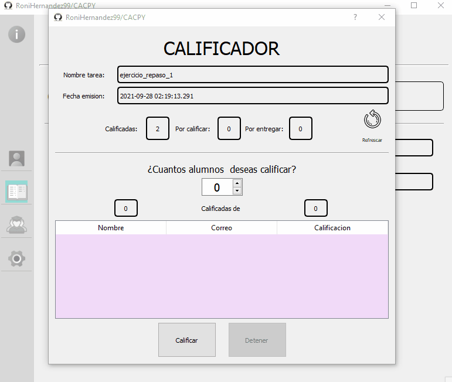
</div>

* Cuando se califica una tarea es probable que un alumno haya ingresado una entrega erronea, es decir  un archivo erroneo como tarea o que no haya adjuntado nada como tarea, cuando suceda que un alumno comete un error al entregar la tarea, en la tabla aparecera su nombre de color rojo.

<div align="center">
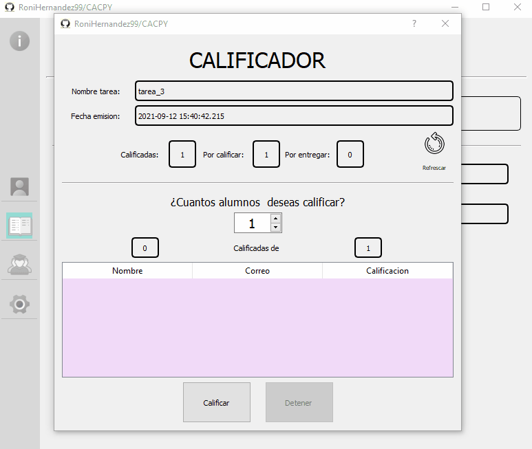
</div>

* Si se desea detener la calificación de las entregas unicamente debera darse clic izquierdo sobre el boton: **'Detener'**


### **2.2.4.5) Creacion de tareas**
<div class="myWrapper" markdown="1" align="left">

[Regresar al menu principal](#menu)
</div>

### **2.2.4.5.1) La importancia de asignar tareas desde CACPY**
<div class="myWrapper" markdown="1" align="left">

[Regresar al menu principal](#menu)
</div>


Es importante mencionar SOLO SE PODRAN calificar  las entregas de las tareas que realicen los estudiantes,SI Y SOLO SI  dichas tareas fueron creadas desde  CACPY, ya que es una retricción de la API de google classroom( las tareas creadas de forma manual no permite google classroom asignarles calificaciones apartir de programas de terceros, google classroom solo permite asignarles calificacion a las tareas que fueron creadas a partir de programas de terceros).

### **2.2.4.5.2) Creando un tarea de programacion**
<div class="myWrapper" markdown="1" align="left">

[Regresar al menu principal](#menu)
</div>

Antes de mencionar los pasos que se deberan seguir para la creación de una tarea de programación es importante aclarar que CACPY **UNICAMENTE CREARA LAS TAREAS EN CLASSROOM EN FORMA DE BORRADOR**, y esto se hace por un razon principal, si CACPY creara la tarea **EN FORMA DE NO BORRADOR**, cuando el usuario creara la tarea desde CACPY, los estudiantes del usuario automaticamente verian en sus notificaciones respectivas de correo el aviso de que fue asignada una tarea, lo cual significa que si el usuario cometio un error con en la creación de la tarea, ya no habria manera de evitar que esas notificaciones se borren del buzon de correo de los estudiantes a pesar de que el usuario elimine dicha tarea desde google classroom, por tal motivo CACPY crea las tareas en forma de borrador, con la finalidad de que el profesor pueda revisar en su classroom respectivo si la tarea que esta en estado de borrador es correcta y si todo es correcta y ya quiera que la vean sus alumnos, el usuario tendra la libertad de asignarla.

Una vez mencionado lo anterior se procede a explicar los pasos a seguir para la creación del borrador de la tarea de google classroom apartir de CACPY:


* **Paso 1-.** Primero debera crearse la tarea en una clase de NbGrader, sin olvidar que dicha clase de NbGrader debe encontrarse almacenada en la misma ruta en donde se encuentra el codigo fuente del programa CACPY, pero en la ruta especifica: **'/RECURSOS/NB_GRADER/'** (esto ya fue explicado en el apartado: '2.2.3.2.2] ¿Donde se encuentran las clases de NbGrader que puedo seleccionar en el programa?' )


* **Paso 2-.** Posteriormente debera subirse a google drive la versión del estudiante de la tarea creada

Ejemplo:

En el siguiente ejemplo se puede apreciar que fue creada una tarea en NbGrader con el nombre de: **'tarea_5'**, posteriormente se descarga la versión para estudiantes y finalmente su sube a google drive dicho archivo:

<div align="center">
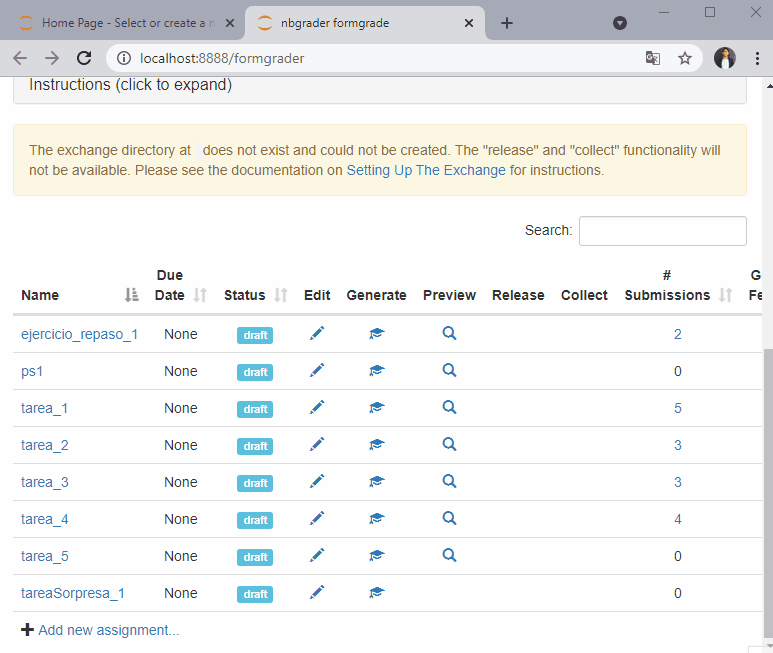
</div>


* **Paso 3-.** Finalmente para asignar el borrador de la  tarea en la clase y topic de  google classroom respectivas, debera irse al apartado: **'Mis tareas'** y dar clic izquierdo sobre el boton: **'Crear tarea'** y posteriormente llenar todos los apartados de la ventana que se abre:

* En el apartado de nombre de la tarea, se debera poner el mismo nombre que se le puso a la tarea en NbGrader.

* En el apartado de **'ID archivo'** se debera adjuntar el id del archivo de la tarea que se subio a google drive

* En el apartado de **'Indicaciones'** se deberan poner las indicaciones de la tarea.

Una vez llenados los apartados debera darse clic sobre el boton: **'Generar borrador de tarea en classroom'**, despues de hacer lo anterior si los datos ingresados son correctos se desplegara un ventana 
preguntando si se esta seguro de querer hacer el borrador de tarea con los datos adjuntados, se debera dar clic sobre la opccion: 'Si', una vez hecho lo anterior se desplegara una ventana explicando lo que pasara, debera leerse detenidamente y finalmente dar clic sobre el boton 'Entendido', cuando esto pase, se creara el borrador de tarea en el topic y clase respectiva de google classroom y se cerrara automaticamente la ventana en donde se adjuntaron los datos de la tarea y por ultimo CACPY abrira de forma automatica en el navegador web la clase de google classroom que almacena la tarea que se acabo de crear como borrador, todo esto con el objetivo de que se pueda ver si la tarea creada es correcta y actuar en consecuencia:
 * Asignarla para que los alumnos la puedan ver y responder
 * Borrarla por que se cometio un error 
 * Editarla por que faltaron datos que poner o se cometieron faltas de ortografia 


<div align="center">
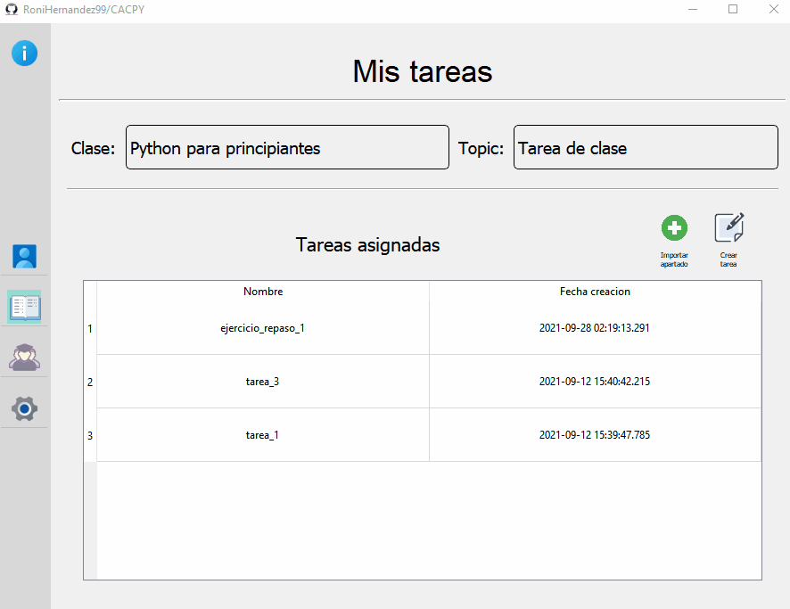
</div>


Es importante mencionar lo siguiente:

* Para poder calificar las entregas que realicen los estudiantes de la tarea recien creada, dicha tarea  debera importarse en la tabla de tareas calificables,sin embargo es importante mencionar que como esta tarea fue recien creada, cuando se desee importar dicha tarea a la tabla de tareas calificables no se podra ver el nombre de esta tarea en la ventana agregadora de tareas, por tal motivo debera darse clic sobre el boton 'Refrescar' y **unicamente aparecera SI YA FUE ASIGNADA es decir si su estado de BORRADOR ya fue cambiado a estado de PUBLIC(ya la pueden resolver y ver los estuiantes)**

<div align="center">

</div>


* Si cuando se crea se desea crear una tarea de programación se presentan dudas con lo que se debe ingresar y cuales son sus restricciones de cada apartado del formulario creador de tareas, entonces debera darse clic sobre el boton que se encuentra al extremo derecho de cada apartado del formulario creador de tareas

<div align="center">
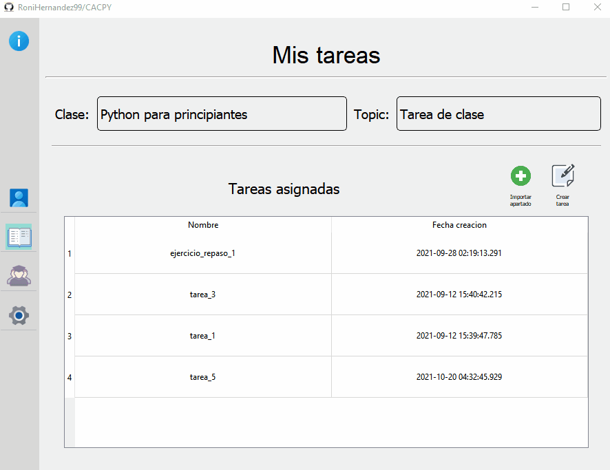
</div>


## **2.2.5) Mis alumnos**
<div class="myWrapper" markdown="1" align="left">

[Regresar al menu principal](#menu)
</div>

El programa  unicamente  permitira el acceso a este apartado hasta que se haya seleccionado en el apartado de configuraciones:

* La clase de classroom en donde se encuentran la o las tareas que se desean calificar
* La carpeta de drive en donde se almacenaran todas las retroalimentaciones.

### **2.2.4.1) Para que sirve el apartado de: 'Mis alumnos'**
<div class="myWrapper" markdown="1" align="left">

[Regresar al menu principal](#menu)
</div>

El apartado de: **'Mis alumnos'** a grosso modo sirve para dos cosas especificamente:

* Ver la lista de nombres y correos electronicos de los alumnos inscritos a la clase de google 
classroom que se selecciono en el apartado: **'Mis configuraciones'**
* Ver  todas las calificaciones de todas las tareas de cada alumno inscrito a tu clase de google classroom
* Ver todas las retroalimentaciones de todas las tareas de programación de cada alumno inscrito a tu clase de google classroom


### **2.2.4.2) Como ver la lista de nombres y correos electronicos de los alumnos inscritos**
<div class="myWrapper" markdown="1" align="center">

[Regresar al menu principal](#menu)
</div>

Para ver la lista de de nombres y correos electronicos de los alumnos inscritos a la clase de google 
classroom que se selecciono en el apartado: **'Mis configuraciones'** se debera hacer lo siguiente:

* **Paso 1-.** Ir al apartado de: **'Mis alumnos'**
* **Paso 2-.** Si al ir al apartado de: **'Mis alumnos'** se ve una lista vacia con cero alumnos a pesar de que en la clase que se selecciono si hay alumnos inscritos, entonces  se debera dar clic sobre 
el boton: **'Refrescar'** al hacer lo anterior se vera los nombres y correos electronicos de los alumnos.


<div align="center">
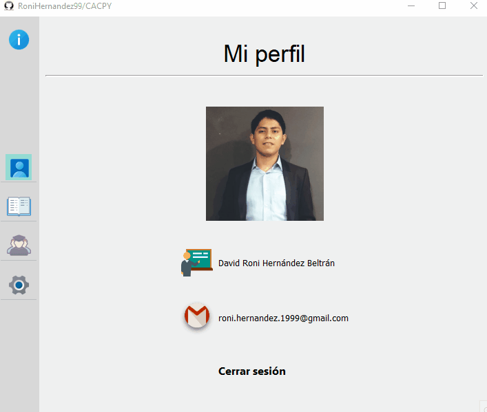
</div>

Es importante mencionar que tambien se pueden eliminar alumnos de la lista de alumnos que se muestra en el programa, unicamente  debera darse clic derecho sobre el nombre del alumno que se desea eliminar y confirmar que se desea eliminar.

**Aclaración:** Es importante mencionar que cada vez que se cierre el programa y se vuelva a abrir, en el apartado de: **'Mis alumnos'** volvera a aparecer que se tienen  cero alumnos inscritos a pesar de que si haya alumnos inscritos, esto es debido a que el programa no realiza ningun respaldo en la base de datos local de quienes son los alumnos inscritos y a que clase pertenencen, por tal motivo existe el boton de refrescar, para que el programa solicite los datos de los alumnos inscritos y los muestre.

### **2.2.4.3) Como ver las calificaciones y retroalimentaciones de cada alumno**
<div class="myWrapper" markdown="1" align="center">

[Regresar al menu principal](#menu)
</div>

Para ver las calificaciones y retroalimentaciones de cada alumno, debera darse doble clic izquierdo sobre el alumno del cual se quieren ver sus calificaciones y retroalimentaciones, una vez hecho lo anterior podra verse lo siguiente:
* Se podra ver el nombre y correo electronico del alumno
* Se podra ver todas las calificaciones de todas las tareas del alumno.
* Se podra ver abajo  del nombre del correo del alumno, lo siguiente: 

'Retroalimentaciones:  <b><u>carpeta de todas las retrolimentaciones</u></b> ' 

Lo cual si se da clic izquierdo sobre: <b><u>carpeta de todas las retrolimentaciones</u></b> 
el programa abrira la carpeta de google drive en donde se almacenan todas las retroalimentaciones de todas las tareas de programación realizadas por dicho alumno.

<div align="center">
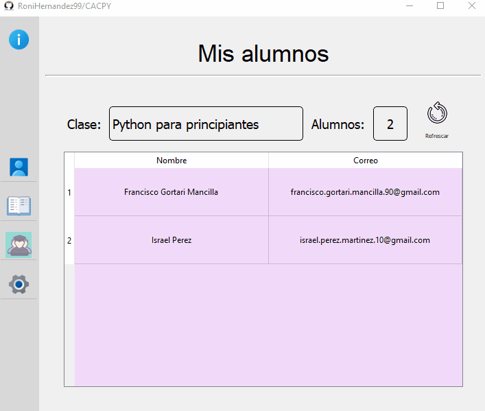
</div>


<hr>

## **3) Errores presentandos en la ejecucion del  programa**
<div class="myWrapper" markdown="1" align="center">

[Regresar al menu principal](#menu)
</div>

<hr>


### **3.1) Errores con las versiones de los paquetes instalados**
<div class="myWrapper" markdown="1" align="left">

[Regresar al menu principal](#menu)
</div>


Anteriormente no habia presentado ningun error al ejecutar CACPY mientras lo programaba, sin embargo cuando decidi
crear otro entorno virtual y volver a instalar los paquetes de python que CACPY requeria para poder funcionar
me di cuenta que CACPY a la hora de calificar las tareas automaticamente me aparecia una serie de errores, y unos de los
mas notables fue el siguiente:

<pre><code>TypeError: 'coroutine' object is not subscriptable</code></pre>

Al investigar en diferentes fuentes de información me percate que dicho error surgio por las nuevas actualizaciones hechas en jupyter y nbgrader, sin embargo la solución temporal que  encontre en lo que los programadores de dichos paquetes arreglan dichos errores fue que necesitaba tener instalado las versiones siguientes de los siguientes paquetes:

<pre><code>nbconvert==5.6.1</code></pre>
<pre><code> jupyter-client==6.1.2</code></pre>

Cuando desintale las versiones que tenia por las versiones que sugerian en la solución del error, todo funciono nuevamente de forma correcta.

Las fuentes de información en las que me apoye en esta solución fueron las siguientes:

* https://github.com/jupyter/jupyter_client/issues/637
* https://forums.fast.ai/t/nbdev-test-nbs-in-ci-coroutine-object-is-not-subscriptable/90817
* https://stackoverflow.com/questions/66988159/nbdev-and-coroutine-object-is-not-subscriptable


### **3.2) Errores de permisos denegados al subir calificación de tarea a classroom**
<div class="myWrapper" markdown="1" align="center">

[Regresar al menu principal](#menu)
</div>

A la hora de probar el funcionamiento de CACPY con diferentes credenciales emitidas por proyectos diferentes de Google Cloud Platform me percate que obtenia un error de falta de permisos a la hora de querer calificar una tarea de forma automatica, es decir me aparecia el siguiente error:

<pre><code>returned "@ProjectPermissionDenied The Developer Console project is not permitted to make this request.". Details: "@ProjectPermissionDenied The Developer Console project is not permitted to make this request."</code></pre>


Despues de investigar me di cuenta del error, y por ende explico lo siguiente: para que CACPY funcione se requiere un archivo de credenciales que se obtiene despues de crear un proyecto en Google Cloud Platform, dicho archivo de credenciales es unico para cada proyecto en Google Cloud Platform creado, dicho archivo de credenciales sirve para generar el token que  permitira el acceso a la API de Google Classroom y Google Drive.Cuando se crea una tarea en Google Classroom con ayuda de CACPY, Google Classroom sabra de que proyecto de Google Cloud Platform vino la petición de la creación de dicha tarea y por ende Google Classroom solo permitira calificaciones automaticas de dicha tarea unicamente provenientes del  **proyecto de Google Cloud Platform** que envio la petición de creación de esa tarea, es decir **si se intenta calificar una tarea de google classroom de forma automatica a traves de un token obtenido de un archivo de credenciales obtenido de un proyecto de Google Cloud Platform que NO fue el que mando la petición para  crear dicha tarea** entonces Google Classroom no permitira la calificación automatica de dicha tarea.En pocas palabras significa que para que Google Classroom te permita asignar calificaciones  de forma automatica se debera usar el mismo proyecto de Google Cloud Platform que se utilizo para crear la tarea que se desea calificar.

La solución a lo anterior es: **utiliza el  archivo de credenciales  de un solo proyecto de Google Cloud Platform para asignar tareas y calificarlas de forma automatica**

Las fuentes de información en las que me apoye en esta solución fueron las siguientes:

* https://stackoverflow.com/questions/38313748/google-classroom-api-modifyattachments

