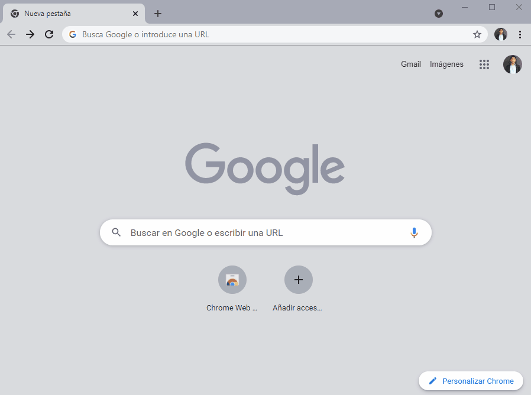
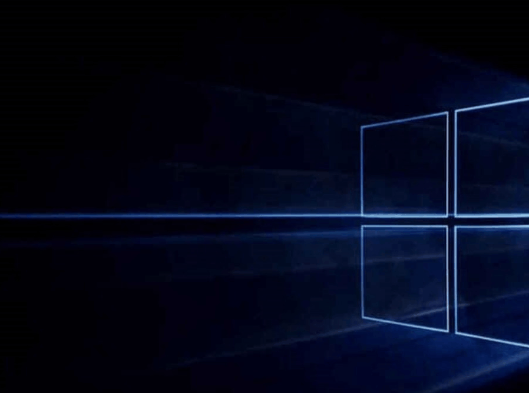
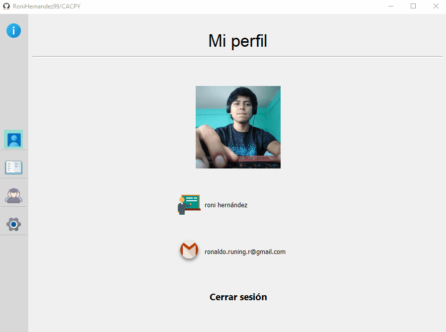
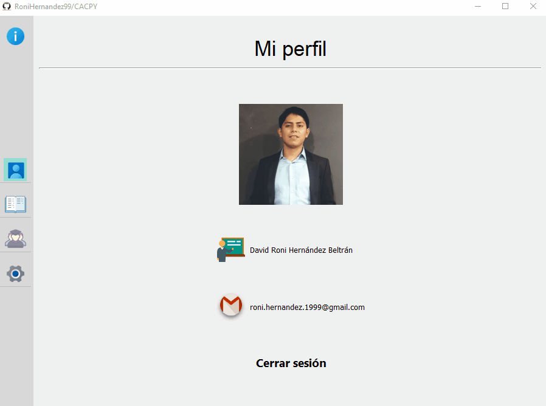

## **CACPY**
#### **C**alificador **A**utomatico **C**lassroom **Py**thon
#### Autor: David Roni Hernández Beltrán

## **Menu**

* [1 Prerrequisitos](#1]-Prerrequisitos)
    * [1.1 Instalación de paquetes de python](#1.1]-Instalación-de-paquetes-de-python)
    * [1.2 Creando un proyecto en Google Cloud Platform, habilitando las APIs requeridas y obteniendo las credecnciasles para la aplicación de escritorio](#1.2]-Creando-un-proyecto-en-Gloud-Cloud-Platform-habilitando-las-APIS-requeridas-y-obteniendo-las-credenciales-para-la-aplicación-de-escriotorio)
    * [1.3 Sistemas operativos](#1.3]-Sistemas-operativos)
* [2 ¿Como usar el programa?](#2]-¿Como-usar-el-programa?)

    * [2.1 La primera vez](#2.1]-La-primera-vez)
    * [2.2 Apartados del programa](#2.2-Apartados-del-programa)
        * [2.2.1 Informacion del programador](#2.2.1]-Informacion-del-programador)
        * [2.2.2 Mi Perfil](#2.2.2]-Mi-Perfil)
        * [2.2.3 Mis configuraciones](#2.2.3]-Mis-configuraciones)
            * [2.2.3.1 Seleccionando la clase de classroom](#2.2.3.1]-Seleccionando-la-clase-de-classroom)
            * [2.2.3.1 Seleccionando la clase de NbGrader](#2.2.3.1]-Seleccionando-la-clase-de-NbGrader)

## **1] Prerrequisitos**

A continuación se enlistan los prerrequisitos para poder ejecutar el sofware:

* Python 3 instalado en la computadora
* La herramienta de gestión de paquetes pip3
* Un proyecto de Google Cloud Platform con:
    * La API de Google Drive habilitada 
    * La API de Google Classroom habilitada
* Las credenciales de autorización para la aplicación de escritorio.

**Observación-. No te preocupes si no sabes como crear un proyecto en Google Cloud Platform y habilitar las APIs requeridas y posteriormente obtener las credecnciasles para la aplicación de escritorio, en el apartado 1.2 se explicara todo ello**

### **1.1] Instalación de paquetes de python**

Para poder ejecutar el programa es necesario tener python 3 instalado, asi como
tambien instalar los siguientes paquetes:
* pyqt5
* google-api-python-client
* google-auth-httplib2
* google-auth-oauthlib
* nbgrader
* rfc3339
* iso8601

Recomendación: Instalar los paquetes  en un **virtualenv** la cual  es una herramienta para crear entornos Python aislados, con el fin de evitar problemas  de dependencias y versiones, si desea consultar información de como instalar un entorno virtual recomiendo el siguiente link: https://docs.python.org/es/3/tutorial/venv.html

A continuación se muestra como poder instalar los paquetes antes mencionados:

### Windows/Mac
* **Alternativa numero 1:** Instalar cada paquete de forma individual

    * Instalando pyqt5:
        <pre><code>pip3 install pyqt5</code></pre>

    * Instalando la biblioteca cliente de Google para Python:

        <pre><code>pip3 install --upgrade google-api-python-client google-auth-httplib2 google-auth-oauthlib</code></pre>

    * Instalando nbgrader:

        <pre><code>pip3 install nbgrader</code></pre>

    * Instalando rfc339:
        <pre><code>pip3 install rfc339</code></pre>

    * Instalando iso8601:
        <pre><code>pip3 install iso8601</code></pre>

* **Alternativa numero 2:** Instalar todos los paquetes con ayuda del archivo **requirements.txt**

    <pre><code>pip3 install -r requirements.txt</code></pre>

### Linux

* Instalando pyqt5:

    <pre><code>sudo apt update</code></pre>
    <pre><code>sudo apt install python3-pyqt5</code></pre>

* Instalando la biblioteca cliente de Google para Python:

    <pre><code>pip3 install --upgrade google-api-python-client google-auth-httplib2 google-auth-oauthlib</code></pre>

* Instalando nbgrader:

    <pre><code>pip3 install nbgrader</code></pre>

* Instalando rfc339:
    <pre><code>pip3 install rfc339</code></pre>

* Instalando iso8601:
    <pre><code>pip3 install iso8601</code></pre>

### **1.2] Creando un proyecto en Google Cloud Platform, habilitando las APIs requeridas y obteniendo las credecnciasles para la aplicación de escritorio**

Para poder iniciar el programa deberas contar con las credenciales de autorización para la 
aplicación de escritorio, y para obtener dichas credenciales deberas crear un proyecto en Google Cloud Platform y habilitar las APIs de Google Drive y Google Classroom a continuación se explicara como hacerlo:

* **Paso 1:** Entrar a Google Cloud Console con la cuenta de Gmail con la que estas gestionando tus clases
de programación.

    

    
    

    

* **Paso 2:** Crear un proyecto con el nombre de tu eleccion, para este ejemplo le llamare: CACPY (Calificador Automatico Classroom Python)

    En el siguiente link enseñan como crear un proyecto de una forma mas detallada: https://developers.google.com/workspace/guides/create-project

* **Paso 3:** Habilitar la API de Google Classroom y la API Google Drive

    

    
    

    En el siguiente link enseñan como habilitar APIs de una forma mas detallada: https://developers.google.com/workspace/guides/create-project 

* **Paso 4:** Configurar y registrar el proyecto con un User Type igual a: **Externos**
    * Paso 1: Dar clic en el icono del Menu principal, el cual se encuentra en la esquina superior izquierda
    * Paso 2: Dar clic izquierdo sobre **APIs & Services > Pantalla de consentimiento de OAuth**
    * Paso 3: Elegir User Type igual a **Externos**
    * Paso 4: Escribir el nombre de la aplicación(puede ser cualquier nombre) para este ejemplo se pone
    el nombre de: **CACPY**
    * Paso 5: Solo se van a llenar los siguiente apartados:
        * En el apartado de correo electrónico de asistencia del usuario escribir su correo electronico
        * En direccion de contacto del desarrollador puedes escribir tu correo electronico, para este 
        ejemplo escribi mi correo electronico: **roni.hernandez.1999@gmail.com**
    * Paso 6: Clic izquierdo sobre **Guardar y continuar**
    * Paso 7: Clic izquierdo sobre **Guardar y continuar**
    * Paso 8: Clic izquierdo sobre **volver al panel**

    

    
    

* **Paso 5:** Agregar los correos electronicos que tendran acceso a la aplicación

    * Paso 1: Dar clic en el icono del Menu principal, el cual se encuentra en la esquina superior izquierda
    * Paso 2: Dar clic izquierdo sobre **APIs & Services > Pantalla de consentimiento de OAuth**
    * Paso 3: Dar clic izquierdo sobre **ADD USERS** 
    * Paso 4: Agregar los correos gmail que podran tener acceso al programa, para este ejemplo decidi agregar los correos:
        * roni.hernandez.1999@gmail.com
        * ronaldo.runing.r@gmail.com
    * Paso 5: Dar clic sobre: **GUARDAR**

    

    
    

* **Paso 6:** Finalmente descargar el archivo de credenciales

    * Paso 1: Dar clic en el icono del Menu principal, el cual se encuentra en la esquina superior izquierda
    * Paso 2: Dar clic izquierdo sobre: **APIs & Services > Credenciales**

    * Paso 3: Dar clic izquierdo sobre:
    **CREAR CREDENCIALES > ID de cliente OAuth**

    * Paso 4: Llenar los apartados siguientes:
        * En el apartado tipo de aplicacion poner: **App de escritorio** 
        * En el nombre de cliente colacar cualquier nombre, para este ejemplo se colocara el nombre default el cual es: **Cliente de escritorio 1**
    * Paso 5: Dar clic izquierdo sobre: **CREAR** 
    * Paso 6: Se desplegara un cuadro emergente con información de las credenciales creadas, unicamente se debe dar clic sobre el boton que dice: **ACEPTAR**

    * Paso 7: Finalmente hay que dirigirse a la tabla que dice **ID de clientes OAuth 2.0** y en la columna que dice: **Acciones** dar clic izquierdo sobre el simbolo de descargar

    

    
    

* **Duda:** ¿Que pasa si despues quiero agregar a mas correos electronicos para que puedan
usar el programa?

### **1.3 Sistemas operativos**

El programa es multiplataforma por lo cual deberia minimo funcionar en: Windows,Linux y Mac.

El programa ha sido probado con exito en los siguientes sistemas operativos:

* MAC
* Windows 10
* Linux Ubuntu 18.04

Sin embargo por cuestiones de disponibilidad de equipo no  ha podido ser probada en otras versiones de los sitemas operativos, sin embargo deberia funcionar en otros sistemas operativas y versiones de estos, debido a que la aplicación es multiplataforma.

## **2] ¿Como usar el programa?**

### **2.1] La primera vez**

Cuando es la primera vez que inicias el programa, deberas cargar el archivo de
credenciales(en el apartado anterior se menciona como obtenerlo), una vez cargado
dicho archivo deberas seleccionar la cuenta de Gmail con la que deseas trabajar y finalmente conceder todos los permisos requeridos, al realizar todo lo mencionado anteriormente se abrira el programa y estara listo para ser usado.A continuación se explica de una forma grafica de como hacer lo anterior mencionado.

Solo la primera vez que ejecutas el programa te pedira hacer todo lo anteriormente 
mencionado, sin embargo en las otras ocasiones cuando se inice sesión bastara con
solo ejecutar el programa:

### **2.2] Apartados del programa**

El programa consta de 5 apartados:

* Informacion del programador
* Perfil
* Tareas
* Alumnos
* Configuraciones

### **2.2.1] Informacion del programador**

En dicho apartado podras visualizar:

* El nombre del desarrollador de esta aplicacion de escritorio(mi nombre)
* El correo electronico del desarrollador(mi correo electronico)
* El likedin del desarrollador(mi likedin)
* El github del desarrollador(mi github)

Es importante mencionar que:
 * Si deseas mandarme un correo electronico  bastara con
dar clic izquierdo sobre el nombre de mi electronico.

*  Si deseas ver mi likedin  bastara con
dar clic izquierdo sobre el nombre de mi likedin.

*  Si deseas ver mi repositorio de github  bastara con
dar clic izquierdo sobre el nombre de mi repositorio

* Y finalmente si deseas ver todo el repositorio de este proyecto
bastara con dar clic izquierdo sobre el nombre del proyecto 

### **2.2.2] Mi Perfil**

El apartado de **'Mi Perfil'** del programa muestra los datos del profesor que ha iniciado sesión
dentro de mi programa, es decir:

* Muestra la foto de perfil de la cuenta de Google con la que inicio sesión el profesor
* Muestra su correo de gmail con el que inicio sesión el profesor
* Muestra el nombre completo del profesor que inicio sesión

En el siguiente ejemplo se pueden apreciar los datos de la cuenta con la que inicie sesión:

Para cerrar el programa hay dos maneras diferentes de hacerlo de hacerlo:

* Dando clic sobre el boton superior derecho con forma de tache
* Dando clic sobre el boton que se encuentra dentro del apartado **'Mi Perfil'**  con la leyenda: **Cerrar sesión**

Es importante mencionar que esas dos alternativas sirven para cerrar el programa, sin embargo lo hacen de una
forma distinta

* Si se cierra el programa dando clic sobre el boton superior derecho con forma de tache los datos del profesor
que inicio sesión en el programa, no se borraran, es decir los siguientes archivos no se borraran:
    * El token que se genero localmente para acceder a la API de Classroom y la API de Drive 
    * La base de datos local que se genero para respaldar datos del Classroom del profesor
    * Los ficheros locales que contienen el nombre y correo electronico del profesor
    * La foto de gmail del profesor

    Ventajas de cerrar el programa dando clic sobre el boton superior derecho con forma de tache:

    * Si se volviera a ejecutar el programa, esto se hara de una forma mas rapida.
    * Se guardaran las configuraciones que el profesor haya hecho la ultima vez que inicio sesión dentro del programa.
    * No se volveran a pedir los permisos para que se vuelva a generar el token.

* Si se cierra el programa dando clic sobre el boton que se encuentra dentro del apartado **'Mi Perfil'**  con la leyenda: **Cerrar sesión** se borraran los siguientes archivos:
    * El token que se genero localmente para acceder a la API de Classroom y la API de Drive 
    * La base de datos local que se genero para respaldar datos del Classroom del profesor
    * Los ficheros locales que contienen el nombre y correo electronico del profesor
    * La foto de gmail del profesor

    Ventaja de cerrar el programa de esta manera:
    * El token que se genero para acceder a la API de Classroom y la API de Drive se elimina

    ¿Cuando puede resultar util? 
    * Si se desea iniciar sesión con otra cuenta de Gmail se debe cerra el programa de esta manera, ya
    que el programa solo permite ser accedido por una sesión a la vez.

### **2.2.3] Mis configuraciones**

En el apartado de configuraciones:
* Debera seleccionarse la clase de classroom  en la cual se encuentran las tareas que se desean calificar.
* Debera seleccionarse la clase de NbGrader en el cual se encuentran las tareas que se desean calificar.
* Debera seleccionarse la carpeta de Google Drive en donde se almacenaran todas las retroalimentaciones 
de las tareas de programación que se califiquen.
* Debera seleccionarse el topic en donde se encuentran las tareas de programación que se desean calificar.

**Observación:Si no se selecciona la clase de classroom,la clase de NbGrader,la carpeta de Google Drive y el topic,entonces no podra accederse al apartado de: 'Mis tareas'.Si no se selecciona por lo menos la clase de classroom y la carpeta de Google Drive, no podra accederse al apartado de: 'Mis alumnos'**

### **2.2.3.1] Seleccionando la clase de classroom**

Para seleccionar una clase de classroom bastara con dar clic izquierdo sobre el boton con  imagen de lapiz que se encuentra al extremo derecho del apartado que dice **Clase**, una vez hecho lo anterior se desplegara un cuadro emergente que nos preguntara acerca de si estamos seguros de querer editar la clase de classroom, se le debe que dar que si, despues de hacer lo anterior se abrira una ventana en donde apareceran todas las clases de classroom de la cuenta de google con la que se entro, se debe seleccionar la clase de classroom en donde se encuentran las tareas de programación que se desean calificar.

La cuenta con la que se entro al programa para este ejemplo tiene 2 clases de classroom

Para este ejemplo se seleccionara la clase: **Python para principiantes** desde el programa:

### **2.2.3.1] Seleccionando la clase de NbGrader**

ScreenToGif

#### Información de como crear proyecto:
https://developers.google.com/workspace/guides/create-project

### Información de como crear las credenciales:
https://developers.google.com/workspace/guides/create-credentials

